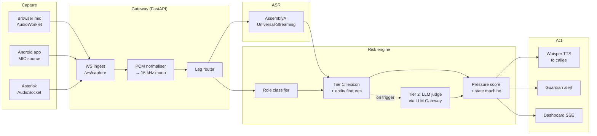
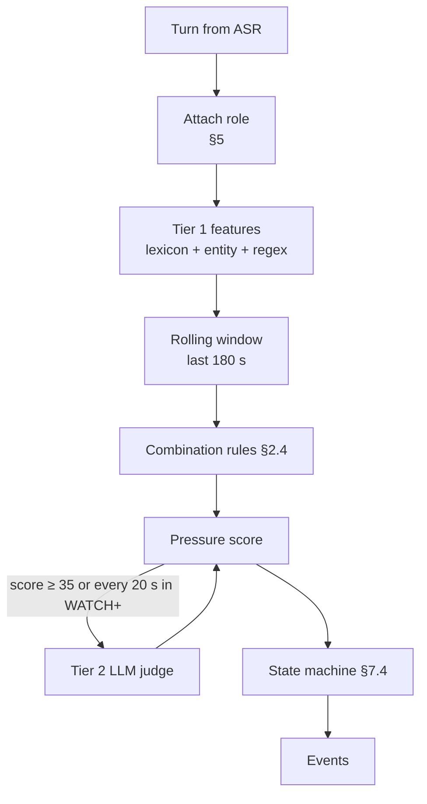
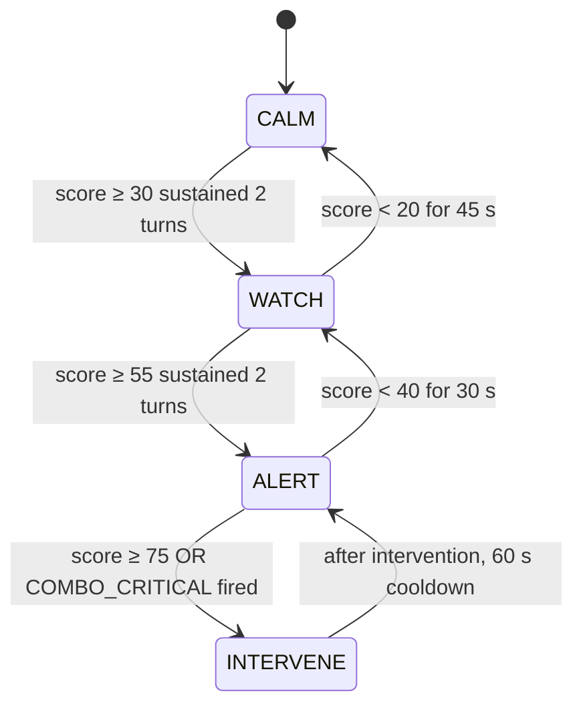

# Ringfence — System Design

**A real-time scam shield that listens to a live phone call and warns the person being scammed.**

| | |
|---|---|
| Version | 1.0 — 4 Sept 2026 |
| Target | AssemblyAI Voice Agent Hackathon (lablab.ai), submission 30 Sept 2026 |
| Status | Design frozen for MVP. Sections marked **[v2]** are explicitly out of scope for the 26-day build. |
| Primary constraint | No telephony vendor. Must be buildable and demoable from Tunisia with no international card. |

---

## 0. Table of contents

1. [Product definition](#1-product-definition)
2. [Threat model and scam taxonomy](#2-threat-model-and-scam-taxonomy)
3. [System architecture](#3-system-architecture)
4. [Capture layer](#4-capture-layer)
5. [Role inference — who is the caller?](#5-role-inference--who-is-the-caller)
6. [ASR layer — AssemblyAI Universal-Streaming](#6-asr-layer--assemblyai-universal-streaming)
7. [Risk engine](#7-risk-engine)
8. [Intervention layer](#8-intervention-layer)
9. [Data model and event schema](#9-data-model-and-event-schema)
10. [Repository layout](#10-repository-layout)
11. [Local development setup](#11-local-development-setup)
12. [Asterisk path (week 2)](#12-asterisk-path-week-2)
13. [Evaluation harness](#13-evaluation-harness)
14. [Corpus design](#14-corpus-design)
15. [Latency and cost budgets](#15-latency-and-cost-budgets)
16. [Privacy, consent and legal posture](#16-privacy-consent-and-legal-posture)
17. [Build schedule](#17-build-schedule)
18. [Demo script](#18-demo-script)
19. [Risks and mitigations](#19-risks-and-mitigations)
20. [References](#20-references)

---

## 1. Product definition

### 1.1 One sentence

Ringfence listens to a phone call as it happens, recognises the *moves* a social engineer makes, and interrupts the victim — not the caller — before the money moves.

### 1.2 Why this is not a transcription product

Every scam-detection demo that fails does the same thing: it keyword-matches. "Gift card" fires an alarm, and the product is a `grep`. Ringfence scores **conversational dynamics**: who is claiming authority, who is being asked to prove identity, which payment rail is being steered toward, and how fast the pressure is climbing. A single move means nothing. Three specific moves inside ninety seconds is a scam with near-certainty.

The consequence for design: the unit of analysis is not the utterance, it is the **rolling window of the conversation**, attributed by role.

### 1.3 Functional requirements

| ID | Requirement |
|---|---|
| F1 | Ingest live call audio from at least one capture adapter without any telephony vendor. |
| F2 | Produce a live transcript with turn boundaries, in English, French and Tunisian Derja. |
| F3 | Attribute each turn to `CALLER` (remote) or `CALLEE` (local) with a confidence. |
| F4 | Detect the signal taxonomy in §2 and maintain a 0–100 **pressure score**. |
| F5 | Transition through a state machine `CALM → WATCH → ALERT → INTERVENE` with hysteresis. |
| F6 | On `INTERVENE`, warn the callee within 2 s and notify a nominated guardian out of band. |
| F7 | Stay silent on legitimate calls. This is the requirement that decides whether the product is real. |
| F8 | Expose a live dashboard: transcript, signal chips, pressure gauge, decision timeline. |
| F9 | Replay a labelled corpus offline and emit metrics. |

### 1.4 Non-functional requirements

| ID | Requirement | Target |
|---|---|---|
| N1 | Time from trigger phrase spoken to visible alert | ≤ 2.0 s p95 |
| N2 | False positive rate on legitimate calls | 0 of 6 corpus calls; report per-call pressure peak |
| N3 | Runs entirely on one laptop | No cloud infra beyond AssemblyAI |
| N4 | Cost per 5-minute call | < $0.05 |
| N5 | No audio persisted by default | In-memory only unless `--record` is passed |

### 1.5 Explicit non-goals

- **Not** a call blocker. Ringfence never terminates or filters calls.
- **Not** voice-clone / deepfake detection. Interesting, but it is a separate research problem and a distraction in 26 days. **[v2]**
- **Not** a PSTN service. No numbers, no carrier integration in the MVP.
- **Not** an agent that talks to the scammer. The intervention speaks only to the callee.

---

## 2. Threat model and scam taxonomy

This section is the actual product. Everything else is plumbing.

### 2.1 The adversary

A human or scripted caller who wants the callee to perform an irreversible value transfer (payment, credential disclosure, or remote device access) inside a single phone call, using manufactured authority and time pressure.

Out of scope: written-channel fraud, in-person fraud, multi-day romance/investment fraud that never resolves in one call.

### 2.2 Signal catalogue

Each signal has an id, a weight, a detector tier, and per-language lexicons. Weights are the starting point; §13 tunes them against the corpus.

| ID | Signal | What it looks like | Weight | Tier |
|---|---|---|---|---|
| `AUTH_CLAIM` | Authority claim | Caller asserts they are the bank, police, tax office, courier, telecom, Microsoft, a ministry | 12 | 1 |
| `VERIF_INVERT` | **Verification inversion** | Caller asks callee to prove identity — read an OTP, a card number, a CVV, a national ID | 30 | 1+2 |
| `RAIL_UNUSUAL` | Unusual payment rail | Gift card, crypto, Western Union, "safe account", D17 / Flouci transfer, prepaid recharge | 25 | 1 |
| `REMOTE_ACCESS` | Remote access request | AnyDesk, TeamViewer, "install this app", screen share, "let me connect" | 25 | 1 |
| `URGENCY` | Manufactured urgency | Deadline, "immediately", "your account closes today", warrant, "within the hour" | 10 | 1 |
| `SECRECY` | Secrecy / isolation | "Don't tell anyone", "don't hang up", "don't discuss this with staff" | 20 | 1 |
| `CALLBACK_SUPPRESS` | Callback suppression | "Stay on the line", "don't call the number on your card" | 18 | 1 |
| `EMOTION_LEVER` | Emotional leverage | Family in trouble, arrest, deportation, prize won | 12 | 2 |
| `SCRIPT_RIGIDITY` | Script rigidity | Caller does not adapt to off-script questions | 8 | 2 |
| `ESCALATION` | Escalation slope | dPressure/dt above threshold — pressure ramping fast | 10 | derived |

### 2.3 Protective signals (negative evidence)

Legitimate institutional calls have a distinct shape. Detecting it is how N2 is met.

| ID | Signal | Weight |
|---|---|---|
| `OFFER_CALLBACK` | Caller invites the callee to hang up and call the official number | −25 |
| `REFUSE_SECRETS` | Caller explicitly refuses to take a full card number / OTP | −30 |
| `BRANCH_REFERRAL` | Caller suggests visiting a branch or office | −15 |
| `NO_ACTION_ASKED` | Call closes with no value transfer requested | −20 |

> A real bank fraud desk *will* claim authority and *will* create urgency. `AUTH_CLAIM + URGENCY` alone must never reach `ALERT`. That is the single most important tuning constraint in the system.

### 2.4 Combination rules

The discriminator is co-occurrence inside a time window, not the sum.

```
COMBO_CRITICAL   = AUTH_CLAIM ∧ (VERIF_INVERT ∨ RAIL_UNUSUAL ∨ REMOTE_ACCESS)   within 90s  → +35
COMBO_ISOLATION  = (SECRECY ∨ CALLBACK_SUPPRESS) ∧ URGENCY                       within 60s  → +20
COMBO_CLASSIC    = AUTH_CLAIM ∧ URGENCY ∧ RAIL_UNUSUAL                           within 120s → +45
```

Combination bonuses only apply when the contributing signals are attributed to `CALLER`. A callee saying "so you want a gift card?" must not incriminate the callee.

### 2.5 Language coverage

Lexicons live in `packages/risk/lexicons/{en,fr,ar_tn}.yaml`. Derja entries are written in both Arabic script and Arabizi (Latin/numeral transliteration), because ASR output for Derja is inconsistent between the two.

```yaml
# ar_tn.yaml (excerpt)
RAIL_UNUSUAL:
  - "كارت تعبئة"
  - "بطاقة شحن"
  - "kart ta3bia"
  - "flouci"
  - "d17"
  - "تحويل فلوس"
VERIF_INVERT:
  - "الكود اللي وصلك"
  - "code mte3ek"
  - "3tini el code"
  - "رقم البطاقة"
SECRECY:
  - "ما تقولش لحتى حد"
  - "matgoulech l7ata 7ad"
  - "ما تقطعش الخط"
```

---

## 3. System architecture

### 3.1 Component diagram



### 3.2 Key design decisions

**D1 — The browser never talks to AssemblyAI directly.**
The gateway holds the API key and owns the upstream socket. This keeps the key server-side, and more importantly the risk engine needs the raw PCM anyway for role inference (§5). One audio path, one place to reason about it.

**D2 — All capture adapters converge on one internal contract.**
Every adapter produces `(session_id, leg_id, pcm16_16k_mono_frames)`. The gateway does not know or care whether the source was a browser, a phone, or a SIP leg. Adding the Android app in week 3 requires zero gateway changes.

**D3 — Two ASR sockets when two legs exist, one when the source is mixed.**
The Asterisk path gives separate legs, so open one AssemblyAI socket per leg and get role attribution for free. The speakerphone path gives one mixed stream, so open one socket and infer role acoustically (§5). Same downstream code.

**D4 — Tier 1 always, Tier 2 on trigger.**
Lexicon features run on every finalised turn in under 5 ms and cost nothing. The LLM judge runs only when tier-1 pressure crosses 35, or every 20 s while in `WATCH` or above. This keeps p95 latency inside budget and cost near zero.

**D5 — Hysteresis, not thresholds.**
A raw score crossing a line produces flapping alerts. The state machine (§7.4) requires sustained evidence to escalate and decays slowly to de-escalate.

---

## 4. Capture layer

### 4.1 Adapter A — Browser / speakerphone (MVP, build first)

The phone is on speaker; the laptop or a second phone runs the web app and hears both sides of the call through its microphone.

**Why this is the product, not a hack.** No one reroutes their calls through a foreign number so an app can listen in. A consumer scam shield lives on the device. Also relevant: Google's Play policy has prohibited using the Accessibility API for call recording since May 2022, so no third-party Android app can tap the call stream directly — speakerphone capture is the remaining legitimate path.

**`packages/capture/browser/worklet.js`**

```js
// AudioWorkletProcessor: float32 @ context rate -> int16 @ 16 kHz, posted in 40 ms frames.
class RingfenceCapture extends AudioWorkletProcessor {
  constructor() {
    super();
    this.ratio = sampleRate / 16000;   // e.g. 48000/16000 = 3
    this.acc = [];
    this.pos = 0;
    this.TARGET = 640;                 // 40 ms @ 16 kHz
  }

  process(inputs) {
    const ch = inputs[0][0];
    if (!ch) return true;

    // Naive decimation is fine here: the browser's own AudioContext is
    // already band-limited, and 16 kHz is well above telephone bandwidth.
    for (let i = this.pos; i < ch.length; i += this.ratio) {
      const s = Math.max(-1, Math.min(1, ch[Math.floor(i)]));
      this.acc.push(s < 0 ? s * 0x8000 : s * 0x7fff);
    }
    this.pos = (this.pos + ch.length) % this.ratio;

    while (this.acc.length >= this.TARGET) {
      const frame = Int16Array.from(this.acc.splice(0, this.TARGET));
      this.port.postMessage(frame.buffer, [frame.buffer]);
    }
    return true;
  }
}
registerProcessor("ringfence-capture", RingfenceCapture);
```

**`apps/dashboard/capture.js`** — wiring

```js
const ws = new WebSocket(`ws://localhost:8000/ws/capture?session=${sessionId}&leg=mixed`);
ws.binaryType = "arraybuffer";

const stream = await navigator.mediaDevices.getUserMedia({
  audio: {
    channelCount: 1,
    echoCancellation: false,   // CRITICAL: AEC will delete the far-end voice
    noiseSuppression: false,   // NS mangles the band-limited phone voice
    autoGainControl: false,    // AGC destroys the level cue role inference needs
  },
});

const ctx = new AudioContext({ sampleRate: 48000 });
await ctx.audioWorklet.addModule("/worklet.js");
const node = new AudioWorkletNode(ctx, "ringfence-capture");
ctx.createMediaStreamSource(stream).connect(node);
node.port.onmessage = (e) => ws.readyState === 1 && ws.send(e.data);
```

> **The three flags above are the single most common way this build fails.** Browser AEC is designed to remove exactly the loudspeaker audio Ringfence needs to hear. Turn all three off, and verify by recording 10 s and confirming the far-end voice is present.

### 4.2 Adapter B — Asterisk AudioSocket (week 2)

See §12 for configuration. The bridge is a plain TCP server.

**`packages/capture/audiosocket/server.py`**

```python
import asyncio, struct, uuid

TYPE_TERMINATE, TYPE_UUID, TYPE_DTMF, TYPE_ERROR = 0x00, 0x01, 0x03, 0xFF
# 0x10..0x18 = slin at 8/12/16/24/32/44.1/48/96/192 kHz, little-endian PCM16 mono.
AUDIO_RATES = {0x10: 8000, 0x11: 12000, 0x12: 16000, 0x13: 24000, 0x14: 32000}

async def handle(reader, writer, on_frame):
    leg_id = None
    while True:
        header = await reader.readexactly(3)
        kind, length = header[0], struct.unpack(">H", header[1:3])[0]
        payload = await reader.readexactly(length) if length else b""

        if kind == TYPE_UUID:
            leg_id = str(uuid.UUID(bytes=payload))
        elif kind in AUDIO_RATES:
            # Do NOT assume 16 kHz. Older Asterisk builds emit 8 kHz even when
            # the dialplan asks for slin16; trust the type byte and resample.
            await on_frame(leg_id, payload, AUDIO_RATES[kind])
        elif kind in (TYPE_TERMINATE, TYPE_ERROR):
            break

    writer.close()

async def serve(on_frame, host="0.0.0.0", port=9092):
    server = await asyncio.start_server(
        lambda r, w: handle(r, w, on_frame), host, port)
    async with server:
        await server.serve_forever()
```

### 4.3 Adapter C — Android **[v2, week 3 if time allows]**

`MediaRecorder.AudioSource.MIC` at 16 kHz while the call is on speaker, foreground service, same WebSocket contract. Nothing else in the system changes. Ship this only if the dashboard and evaluation are already finished.

---

## 5. Role inference — who is the caller?

On the mixed speakerphone stream there is one audio channel containing two people. Streaming ASR gives turn boundaries but not identity, and diarisation is a pre-recorded feature, not a streaming one. So role is inferred acoustically.

### 5.1 The cue

The far-end voice has travelled through a telephone codec. It is band-limited to roughly 300–3400 Hz and has almost no energy above 4 kHz. The near-end voice is in the room, picked up directly, with full spectral content. That difference is large, stable, and cheap to compute.

```
hf_ratio = Σ|X(f)| for f ∈ [4000, 8000)  /  Σ|X(f)| for f ∈ [300, 3400)
```

**`packages/risk/role.py`**

```python
import numpy as np

SR = 16000

def hf_ratio(frame_i16: np.ndarray) -> float:
    x = frame_i16.astype(np.float32) / 32768.0
    if np.sqrt(np.mean(x**2)) < 0.005:          # silence guard
        return float("nan")
    spec = np.abs(np.fft.rfft(x * np.hanning(len(x))))
    freqs = np.fft.rfftfreq(len(x), 1 / SR)
    band = lambda lo, hi: spec[(freqs >= lo) & (freqs < hi)].sum() + 1e-9
    return float(band(4000, 8000) / band(300, 3400))


class RoleClassifier:
    """Two-cluster online classifier. Calibrates in the first ~8 s of the call."""

    def __init__(self, calib_frames: int = 200):   # 200 * 40 ms = 8 s
        self.samples: list[float] = []
        self.calib_frames = calib_frames
        self.threshold: float | None = None

    def observe(self, frame_i16) -> None:
        r = hf_ratio(frame_i16)
        if not np.isnan(r):
            self.samples.append(r)
            if self.threshold is None and len(self.samples) >= self.calib_frames:
                # Otsu-style split on log ratio: two voices, two clusters.
                v = np.log(np.array(self.samples) + 1e-9)
                self.threshold = float(np.exp(_otsu(v)))

    def classify(self, turn_frames) -> tuple[str, float]:
        ratios = [r for r in (hf_ratio(f) for f in turn_frames) if not np.isnan(r)]
        if not ratios or self.threshold is None:
            return "UNKNOWN", 0.0
        med = float(np.median(ratios))
        margin = abs(np.log(med) - np.log(self.threshold))
        role = "CALLEE" if med > self.threshold else "CALLER"
        return role, min(1.0, margin / 0.7)       # 0.7 nat ≈ 2x ratio ≈ confident
```

### 5.2 How this gets validated — and why it is a slide

Run the same role-played call through **both** capture paths. Asterisk gives two separate legs, which is ground truth. The speakerphone path gives the mixed stream. Compare the classifier's per-turn labels against the Asterisk labels and report a single number: **role attribution accuracy**.

That number is the measured result the submission needs (§13). It also justifies building the Asterisk path at all: it is the measuring instrument for the shipping path.

### 5.3 Degradation policy

If `confidence < 0.4`, the turn is marked `UNKNOWN`. Combination rules that require `CALLER` attribution do not fire on `UNKNOWN` turns, but tier-1 signals still accumulate at half weight. The system degrades toward silence, never toward false alarms.

---

## 6. ASR layer — AssemblyAI Universal-Streaming

### 6.1 Connection

| | |
|---|---|
| Endpoint | `wss://streaming.assemblyai.com/v3/ws` |
| Auth | `Authorization: <API_KEY>` header — **no `Bearer` prefix** |
| Audio | Binary WebSocket frames, mono 16-bit PCM, little-endian |
| Sample rate | 16000, declared as a query parameter |
| Session cap | 3 hours |
| Rate | $0.15/hr, billed on session duration, unlimited concurrent streams |

Query parameters used:

```
?sample_rate=16000
&format_turns=true
&speech_model=universal-3-5-pro
```

Messages received: `Begin` (`id`, `expires_at`), `Turn` (`turn_order`, `transcript`, `end_of_turn`, `turn_is_formatted`, `end_of_turn_confidence`, `words[]`), `Termination` (`audio_duration_seconds`, `session_duration_seconds`). Session is closed politely by sending `{"type": "Terminate"}`.

### 6.2 Client

**`packages/asr/streaming.py`**

```python
import asyncio, json, os, websockets

URL = ("wss://streaming.assemblyai.com/v3/ws"
       "?sample_rate=16000&format_turns=true&speech_model=universal-3-5-pro")


class StreamingSession:
    """One AssemblyAI socket. One per leg."""

    def __init__(self, leg_id: str, on_turn):
        self.leg_id = leg_id
        self.on_turn = on_turn
        self.q: asyncio.Queue[bytes | None] = asyncio.Queue(maxsize=200)
        self._ws = None

    async def run(self) -> None:
        headers = {"Authorization": os.environ["ASSEMBLYAI_API_KEY"]}
        async with websockets.connect(URL, additional_headers=headers) as ws:
            self._ws = ws
            await asyncio.gather(self._pump(ws), self._recv(ws))

    async def _pump(self, ws) -> None:
        while (frame := await self.q.get()) is not None:
            await ws.send(frame)                       # binary
        await ws.send(json.dumps({"type": "Terminate"}))

    async def _recv(self, ws) -> None:
        async for raw in ws:
            msg = json.loads(raw)
            if msg["type"] == "Turn":
                await self.on_turn(self.leg_id, msg)
            elif msg["type"] == "Termination":
                return

    def feed(self, pcm: bytes) -> None:
        try:
            self.q.put_nowait(pcm)
        except asyncio.QueueFull:
            pass          # drop rather than block the capture path
```

### 6.3 Turn handling policy

- Act on **partial** turns for the pressure score — waiting for `end_of_turn` costs a full second of latency and the whole product is latency.
- Act on **formatted final** turns (`end_of_turn=true and turn_is_formatted=true`) for the transcript that gets stored and for the LLM judge window.
- Deduplicate: a `Turn` with the same `turn_order` supersedes the previous one. Keep the latest per `turn_order`.

### 6.4 Language handling

Universal-Streaming is configured per socket. For the corpus runs, the language is known per file. For a live call, run the first 15 s through the multilingual streaming model, take the dominant language, and keep it for the session. Code-switching within Derja/French is handled by the model rather than by switching sockets mid-call — switching sockets loses the turn context that the risk engine depends on.

**Known limitation to state on a slide:** Derja transcription quality is uneven and Arabizi output is inconsistent. This is why the lexicons carry both scripts, and why tier 2 (§7.3) does the semantic work that lexicons cannot.

---

## 7. Risk engine

### 7.1 Pipeline



### 7.2 Tier 1 — deterministic features

**`packages/risk/features.py`**

```python
import re, time
from dataclasses import dataclass, field

@dataclass
class SignalHit:
    signal: str
    weight: float
    role: str
    t: float
    evidence: str

@dataclass
class Window:
    """Rolling 180 s evidence window."""
    span: float = 180.0
    hits: list[SignalHit] = field(default_factory=list)

    def add(self, hit: SignalHit) -> None:
        self.hits.append(hit)
        cutoff = hit.t - self.span
        self.hits = [h for h in self.hits if h.t >= cutoff]

    def has(self, signal: str, within: float, now: float,
            role: str = "CALLER") -> bool:
        return any(h.signal == signal and h.role == role and now - h.t <= within
                   for h in self.hits)


class Tier1:
    def __init__(self, lexicons: dict, weights: dict):
        self.lex = {sig: re.compile("|".join(map(re.escape, terms)), re.I)
                    for sig, terms in lexicons.items()}
        self.weights = weights
        # OTP / card-number shapes are language independent and high signal.
        self.otp = re.compile(r"\b\d{4,8}\b")
        self.pan = re.compile(r"\b(?:\d[ -]?){13,19}\b")

    def extract(self, text: str, role: str, t: float) -> list[SignalHit]:
        hits = []
        for sig, rx in self.lex.items():
            if m := rx.search(text):
                hits.append(SignalHit(sig, self.weights[sig], role, t, m.group(0)))
        if role == "CALLER" and (self.otp.search(text) or self.pan.search(text)):
            hits.append(SignalHit("VERIF_INVERT",
                                  self.weights["VERIF_INVERT"], role, t, "numeric"))
        return hits
```

Scoring, with combination bonuses and decay:

```python
COMBOS = [
    ("COMBO_CRITICAL", 35, lambda w, t: w.has("AUTH_CLAIM", 90, t) and (
        w.has("VERIF_INVERT", 90, t) or w.has("RAIL_UNUSUAL", 90, t)
        or w.has("REMOTE_ACCESS", 90, t))),
    ("COMBO_ISOLATION", 20, lambda w, t: (
        w.has("SECRECY", 60, t) or w.has("CALLBACK_SUPPRESS", 60, t))
        and w.has("URGENCY", 60, t)),
    ("COMBO_CLASSIC", 45, lambda w, t: w.has("AUTH_CLAIM", 120, t)
        and w.has("URGENCY", 120, t) and w.has("RAIL_UNUSUAL", 120, t)),
]

def score(window: Window, now: float, judge_delta: float = 0.0) -> tuple[float, list[str]]:
    base, fired = 0.0, []
    seen: set[tuple[str, str]] = set()
    for h in window.hits:
        key = (h.signal, h.role)
        if key in seen:                       # a signal counts once per window
            continue
        seen.add(key)
        age_decay = max(0.4, 1.0 - (now - h.t) / window.span)
        role_factor = 1.0 if h.role == "CALLER" else (
            0.5 if h.role == "UNKNOWN" else 0.0)
        base += h.weight * age_decay * role_factor
    for name, bonus, pred in COMBOS:
        if pred(window, now):
            base += bonus
            fired.append(name)
    return max(0.0, min(100.0, base + judge_delta)), fired
```

### 7.3 Tier 2 — the LLM judge

Called via AssemblyAI's LLM Gateway. Triggered when tier-1 score ≥ 35, or every 20 s while in `WATCH` or above, or on any `RAIL_UNUSUAL` / `REMOTE_ACCESS` hit regardless of score.

**`packages/risk/judge.py`** — prompt contract

```
SYSTEM
You analyse a live phone call for social-engineering fraud. You are given the
last 180 seconds of dialogue with speaker roles. CALLER is the remote party;
CALLEE is the person being protected.

Judge only the CALLER's behaviour. Legitimate institutions do claim authority
and do create urgency — those alone are not fraud. Fraud is indicated when the
CALLER steers toward an irreversible transfer of money, credentials or device
control while suppressing the CALLEE's ability to verify independently.

Return JSON only, matching the schema. If the dialogue is ambiguous or too
short to judge, return verdict "unclear" with adjustment 0.

SCHEMA
{
  "verdict": "benign" | "unclear" | "suspicious" | "fraud",
  "adjustment": integer,          // -30..+30, applied to the rule-based score
  "signals": [string],            // ids from the taxonomy you actually observed
  "rationale": string,            // <= 25 words, shown in the UI
  "protective": [string]          // protective signals observed, if any
}
```

Design notes:

- The judge **adjusts**, it does not decide. A hallucinating model can move the score by ±30, never set it. The rules keep control.
- `rationale` is capped at 25 words because it is rendered live in the dashboard; anything longer does not fit and does not get read.
- Ask for `protective` explicitly. Models are much better at spotting fraud than at spotting its absence unless you make absence a required output field.
- Temperature 0. Cache nothing — the window changes every call.

### 7.4 State machine



| State | Callee sees / hears | Guardian |
|---|---|---|
| `CALM` | Nothing | — |
| `WATCH` | Ambient indicator only | — |
| `ALERT` | On-screen banner, no audio | — |
| `INTERVENE` | Spoken warning in-ear + banner | Notified |

Escalation requires evidence sustained across **two consecutive turns**; de-escalation requires a quiet period. This is what stops a single unlucky phrase from firing the alarm.

---

## 8. Intervention layer

### 8.1 The whisper

A short, specific, actionable line — never a generic "this may be a scam".

```python
TEMPLATES = {
  "RAIL_UNUSUAL":  "Stop. A bank will never ask you to buy gift cards or transfer to a safe account.",
  "VERIF_INVERT":  "Stop. Never read a code or card number to someone who called you.",
  "REMOTE_ACCESS": "Stop. Do not install anything or give anyone access to your phone.",
  "DEFAULT":       "Hang up and call the number on the back of your card yourself.",
}
```

Selection: the highest-weight `CALLER` signal in the last 60 s picks the template; fall back to `DEFAULT`.

Delivery in the MVP is TTS played to the callee's device output, plus the dashboard banner. In the browser demo this is `speechSynthesis` or an audio element — do **not** spend hackathon days on a TTS vendor here; the warning content is what matters, not its timbre.

> **Do not route the warning into the call.** The scammer must not learn that a shield exists, or the next script routes around it.

### 8.2 Guardian alert

A nominated contact receives, out of band: timestamp, caller number if known, the fired signals, the 25-word rationale, and a one-tap "call them now" link.

MVP transport: a webhook plus the dashboard. **[v2]** SMS or push. Do not take an SMS-vendor dependency for the demo — that reintroduces exactly the problem this architecture removed.

### 8.3 Dashboard

The demo money-shot. Single page, three regions:

1. **Pressure gauge** — 0–100, colour by state, with the state name.
2. **Live transcript** — turns coloured by role, with signal chips inline where they fired.
3. **Timeline** — signals and state transitions on a time axis, so the *slope* is visible.

Transport is SSE from `/events/{session_id}`. SSE, not WebSocket: it is one-directional, reconnects for free, and is three lines of client code.

---

## 9. Data model and event schema

```python
from dataclasses import dataclass
from typing import Literal

Role = Literal["CALLER", "CALLEE", "UNKNOWN"]
State = Literal["CALM", "WATCH", "ALERT", "INTERVENE"]

@dataclass
class Session:
    id: str
    started_at: float
    language: str
    capture: Literal["browser", "audiosocket", "android", "replay"]
    legs: list[str]

@dataclass
class Utterance:
    session_id: str
    leg_id: str
    turn_order: int
    text: str
    role: Role
    role_confidence: float
    t_start: float
    t_end: float
    is_final: bool
    is_formatted: bool

@dataclass
class RiskSnapshot:
    session_id: str
    t: float
    score: float
    state: State
    fired_signals: list[str]
    fired_combos: list[str]
    judge_verdict: str | None
    judge_rationale: str | None

@dataclass
class Intervention:
    session_id: str
    t: float
    trigger_signal: str
    message: str
    guardian_notified: bool
```

**Wire format** — every SSE event is `{"type": ..., "payload": ...}` with `type` in `session.start | utterance | risk | intervention | session.end`. One schema for live and replay, so the dashboard cannot tell the difference. That property is what lets you rehearse the demo deterministically.

---

## 10. Repository layout

```
ringfence/
├── apps/
│   ├── gateway/
│   │   ├── main.py              # FastAPI: /ws/capture, /events/{sid}, /health
│   │   ├── session.py           # Session lifecycle, leg routing
│   │   └── bus.py               # In-process pub/sub -> SSE
│   ├── dashboard/
│   │   ├── index.html
│   │   ├── capture.js           # getUserMedia + worklet wiring
│   │   ├── worklet.js
│   │   └── app.js               # SSE client, gauge, transcript, timeline
│   └── android/                 # [v2]
├── packages/
│   ├── capture/
│   │   └── audiosocket/server.py
│   ├── asr/
│   │   ├── streaming.py         # AssemblyAI WS client
│   │   └── resample.py
│   ├── risk/
│   │   ├── role.py              # acoustic role classifier
│   │   ├── features.py          # tier 1
│   │   ├── judge.py             # tier 2, LLM Gateway
│   │   ├── state.py             # state machine
│   │   ├── weights.yaml
│   │   └── lexicons/{en,fr,ar_tn}.yaml
│   ├── intervene/
│   │   ├── whisper.py
│   │   └── guardian.py
│   └── eval/
│       ├── replay.py            # feed corpus audio as if live
│       └── metrics.py           # TTD, precision/recall, FPR, role accuracy
├── corpus/
│   ├── scripts/                 # the role-play scripts, markdown
│   ├── audio/                   # wav, 16 kHz mono
│   └── labels/                  # ground-truth JSON per file
├── infra/
│   ├── docker-compose.yml
│   └── asterisk/{pjsip.conf,extensions.conf,ari.conf,asterisk.conf}
├── .env.example
├── pyproject.toml
└── README.md
```

---

## 11. Local development setup

### 11.1 Prerequisites

- Python 3.11+
- Node not required — the dashboard is plain ES modules served by FastAPI
- Docker (week 2, for Asterisk only)
- An AssemblyAI API key (free credits: ~333 streaming hours)

### 11.2 Bootstrap

```bash
git clone <your-repo> ringfence && cd ringfence
python -m venv .venv && source .venv/bin/activate
pip install fastapi "uvicorn[standard]" websockets numpy pyyaml httpx sse-starlette soundfile
cp .env.example .env      # add ASSEMBLYAI_API_KEY
```

`.env.example`

```bash
ASSEMBLYAI_API_KEY=
RINGFENCE_LANG=auto              # auto | en | fr | ar
RINGFENCE_JUDGE_MODEL=           # LLM Gateway model id
RINGFENCE_JUDGE_ENABLED=true
RINGFENCE_RECORD=false           # true writes wav to corpus/audio/ for dev only
RINGFENCE_GUARDIAN_WEBHOOK=
```

### 11.3 Run

```bash
uvicorn apps.gateway.main:app --reload --port 8000
# open http://localhost:8000  -> Start session -> allow microphone
```

### 11.4 Day-one smoke test

The order matters — each step isolates one failure mode.

1. `curl localhost:8000/health` → `{"ok": true}`
2. Start a session, speak, confirm frames arrive: gateway logs `leg=mixed frames=… rms=…`. If `rms` is near zero, the microphone flags in §4.1 are wrong.
3. Confirm `Begin` from AssemblyAI in the logs. A 4xx here is almost always the `Bearer` prefix — there must not be one.
4. Speak a full sentence; confirm a `Turn` with `end_of_turn=true`.
5. Put a real phone call on speaker next to the laptop and confirm **both** voices reach the transcript. This is the make-or-break check.
6. Say a scripted trigger line; confirm a `SignalHit` in the logs and a chip in the dashboard.

### 11.5 Offline development without burning credits

`packages/eval/replay.py` streams a wav from `corpus/audio/` into the same pipeline at real-time pace. Add `--asr=cached` to reuse a stored transcript instead of calling AssemblyAI, so risk-engine tuning costs nothing. Tune weights against cached transcripts; re-run live only to verify.

---

## 12. Asterisk path (week 2)

Purpose: ground truth for §5.2, and the architecture slide showing carrier-side deployment.

### 12.1 `infra/docker-compose.yml`

```yaml
services:
  asterisk:
    image: andrius/asterisk:20-current
    network_mode: host          # SIP + RTP are hostile to bridged networking
    volumes:
      - ./asterisk:/etc/asterisk:ro
```

### 12.2 `infra/asterisk/pjsip.conf`

```ini
[transport-udp]
type = transport
protocol = udp
bind = 0.0.0.0:5060

[alice]                         ; the callee — softphone on the laptop
type = endpoint
context = ringfence
disallow = all
allow = slin16                  ; wideband: better ASR than g711
auth = alice-auth
aors = alice

[alice-auth]
type = auth
auth_type = userpass
username = alice
password = changeme-alice

[alice]
type = aor
max_contacts = 1

[bob]                           ; the caller — softphone on the phone
type = endpoint
context = ringfence
disallow = all
allow = slin16
auth = bob-auth
aors = bob

[bob-auth]
type = auth
auth_type = userpass
username = bob
password = changeme-bob

[bob]
type = aor
max_contacts = 1
```

### 12.3 `infra/asterisk/extensions.conf`

```ini
[ringfence]
; Dial the other party, and fork BOTH legs to the bridge on distinct UUIDs.
; ${UNIQUEID} keeps the two legs of one call correlated.

exten => 100,1,NoOp(ringfence: ${CALLERID(num)} -> alice)
 same => n,Set(RF_SESSION=${UNIQUEID})
 same => n,Set(AUDIOHOOK_INHERIT(MixMonitor)=yes)
 same => n,Dial(PJSIP/alice,30,U(rf-fork^caller))

exten => 200,1,NoOp(ringfence: ${CALLERID(num)} -> bob)
 same => n,Set(RF_SESSION=${UNIQUEID})
 same => n,Dial(PJSIP/bob,30,U(rf-fork^callee))

[rf-fork]
; Called on the answered channel. Forks that single leg to the bridge.
exten => s,1,NoOp(forking leg ${ARG1} of session ${RF_SESSION})
 same => n,AudioSocket(${RF_SESSION},127.0.0.1:9092)
 same => n,Return()
```

> **Version gotcha.** `AudioSocket()` has shipped builds that emit 8 kHz even when the channel format is `slin16`. Do not assume the rate — read it from the type byte (§4.2) and resample. The bridge in this design already does that, which is why it is written that way.

**Alternative:** ARI `POST /ari/channels/externalMedia` with `format=slin16`, `encapsulation=audiosocket`, `transport=tcp`. More control, more moving parts. Use the dialplan version unless you hit a wall — check your Asterisk version's own documentation for the exact parameter set before writing that code.

### 12.4 Softphones

Linphone on the laptop registering as `alice`, Zoiper on the handset as `bob`, both pointed at the laptop's LAN IP. Dial `100` / `200`. Two legs, two AssemblyAI sockets, perfect role labels.

---

## 13. Evaluation harness

Without this section the submission is a demo. With it, it is a result.

### 13.1 Metrics

| Metric | Definition | Target |
|---|---|---|
| **TTD** | Seconds from the first ground-truth scam signal to entering `ALERT` | median ≤ 25 s |
| **FPR** | Legitimate corpus calls that ever reach `ALERT` | **0 of 6** |
| **Peak margin** | Highest score on any legitimate call vs `ALERT` threshold | ≥ 15 points of headroom |
| **Call recall** | Scam calls that reach `INTERVENE` before the value transfer line | ≥ 90% |
| **Role accuracy** | Per-turn role labels vs Asterisk ground truth | ≥ 85% |
| **Signal F1** | Per-signal detection vs labels | reported per signal |

### 13.2 Label format

`corpus/labels/scam_bank_fr_01.json`

```json
{
  "file": "audio/scam_bank_fr_01.wav",
  "language": "fr",
  "label": "scam",
  "scam_family": "bank_impersonation",
  "transfer_line_t": 132.4,
  "turns": [
    {"t_start": 0.0,  "t_end": 4.2,  "role": "CALLER",
     "signals": ["AUTH_CLAIM"]},
    {"t_start": 12.8, "t_end": 18.1, "role": "CALLER",
     "signals": ["URGENCY", "CALLBACK_SUPPRESS"]},
    {"t_start": 96.0, "t_end": 104.5, "role": "CALLER",
     "signals": ["VERIF_INVERT"]}
  ]
}
```

`transfer_line_t` is the moment the scammer asks for the actual transfer. Detecting after that point is a failure even if the label is right — the metric that matters is *warned in time*, not *classified correctly*.

### 13.3 Runner

```bash
python -m packages.eval.replay --all --report reports/$(date +%F).json
python -m packages.eval.metrics reports/2026-09-21.json --markdown > reports/latest.md
```

`replay.py` streams at real-time pace by default; `--fast` skips the pacing for weight tuning. Weight tuning uses `--asr=cached`, so a full sweep over the corpus is free.

---

## 14. Corpus design

**Start this on day one. It is the critical path, not the code.**

### 14.1 Composition — 22 recordings

| Class | Count | Languages |
|---|---|---|
| Bank impersonation | 3 | en, fr, ar_tn |
| Tech support / remote access | 3 | en, fr, ar_tn |
| Delivery / customs fee | 3 | en, fr, ar_tn |
| Police / legal threat | 2 | fr, ar_tn |
| Prize / lottery | 2 | fr, ar_tn |
| Family emergency | 3 | en, fr, ar_tn |
| **Legitimate — real bank fraud desk** | 2 | fr, ar_tn |
| **Legitimate — delivery, doctor, telecom upsell, survey** | 4 | mixed |

The six legitimate calls carry more weight than the sixteen scam calls. They are what the FPR metric is computed on, and FPR is the number a judge will interrogate.

### 14.2 Recording protocol

- Record **through a real phone call on speaker**, not two people in a room. The band-limiting on the far-end voice is a feature the system depends on — recording it in a room destroys the very cue role inference uses.
- Two devices, one script each. The "caller" reads from the script; the "callee" improvises normally, including asking sceptical questions.
- 16 kHz mono wav, one file per call.
- Label immediately after recording while you remember what happened. Labelling a week later takes three times as long.
- Written consent from everyone recorded, kept in `corpus/CONSENT.md`. Say on the submission slide that the corpus is consented role-play, not intercepted calls.

### 14.3 Scripts

Write scripts as markdown in `corpus/scripts/` with the ground-truth signals annotated inline, so labels can be derived semi-automatically:

```markdown
## scam_bank_fr_01

**CALLER:** Bonjour, je vous appelle du service anti-fraude de votre banque. <!-- AUTH_CLAIM -->
**CALLEE:** Ah bon ? C'est à quel sujet ?
**CALLER:** Nous avons détecté une transaction suspecte. Il faut agir tout de suite,
sinon votre compte sera bloqué ce soir. <!-- URGENCY -->
**CALLEE:** Je peux vous rappeler sur le numéro de ma carte ?
**CALLER:** Non, ne raccrochez surtout pas, la ligne est sécurisée. <!-- CALLBACK_SUPPRESS -->
...
```

---

## 15. Latency and cost budgets

### 15.1 Latency, trigger phrase to visible alert

| Stage | Budget |
|---|---|
| Capture buffering (40 ms frames) | 40–80 ms |
| Gateway hop, in process | < 5 ms |
| AssemblyAI partial transcript | ~300 ms |
| Tier 1 features + scoring | < 5 ms |
| Tier 2 LLM judge, when triggered | 400–900 ms |
| SSE to dashboard render | < 50 ms |
| TTS whisper start | ~300 ms |
| **Total, tier-1-only path** | **~450 ms** |
| **Total, with judge** | **~1.4 s** |

Within the 2.0 s p95 target with headroom. If the judge is the bottleneck on demo day, fire the banner on tier 1 and let the judge's rationale populate a moment later — the *warning* must be fast, the *explanation* need not be.

### 15.2 Cost per 5-minute call

| Item | Cost |
|---|---|
| Universal-Streaming, 1 leg × 5 min | $0.0125 |
| Second leg (Asterisk path only) | $0.0125 |
| LLM judge, ~8 calls × ~1.5k tokens | ~$0.01 |
| **Total** | **< $0.04** |

Against free credits of ~333 streaming hours, the entire build and every rehearsal fits inside the free tier. **No payment method is required to complete this project.**

---

## 16. Privacy, consent and legal posture

This belongs on a slide, not in a footnote — it is a trust product.

- **Ringfence runs on the callee's own device, on the callee's own call, with the callee's consent.** It is closer to a hearing aid than to a wiretap. Frame it that way and mean it.
- **Nothing is persisted by default.** Audio lives in memory. `RINGFENCE_RECORD=true` exists for development only and is off in every build that is demoed.
- **Redaction before storage.** If a deployment does persist transcripts, PII redaction runs first — AssemblyAI prices text redaction at $0.08/hr and audio redaction at $0.05/hr, which is cheap enough that there is no excuse.
- **The guardian sees a verdict, not a transcript.** Signals fired and a 25-word rationale. Never the call content.
- **Recording consent varies by jurisdiction** and by whether the far party must be informed. State the assumption you are operating under; do not claim it is settled.
- **Check who may terminate international VoIP traffic** before promising a carrier-grade PSTN product. It does not affect the on-device path, which is one more reason that path is the right one.

---

## 17. Build schedule

26 days, 4 Sept → 30 Sept. Corpus work runs in parallel from day one because it is the true critical path.

| Dates | Milestone | Done means |
|---|---|---|
| **4–7 Sept** | Skeleton + first audio | Repo public, daily commits. Browser mic → gateway → AssemblyAI → transcript in the console. First 4 corpus recordings done. |
| **8–10 Sept** | Tier 1 + score | Lexicons for en/fr, features, window, combination rules, score visible in logs. 10 recordings done. |
| **11–13 Sept** | Role inference | `RoleClassifier` working on mixed audio, confidence reported. Derja lexicon drafted. |
| **14–16 Sept** | Dashboard, deployed | Gauge, transcript, timeline, live over SSE. **Public URL live from 16 Sept.** |
| **17–19 Sept** | Tier 2 judge + state machine | Judge integrated, hysteresis tuned, interventions firing with the right template. |
| **20–22 Sept** | Asterisk + ground truth | Two-leg capture working; role accuracy measured against it. All 22 recordings labelled. |
| **23–25 Sept** | Evaluation + tuning | Full metric run. FPR driven to 0 on the legitimate set. Numbers frozen for the deck. |
| **26–28 Sept** | Pitch | 4–5 min video, 8–10 slides, README polished. |
| **29 Sept** | **Submit** | Do not wait for the 30th. |
| **30 Sept** | Buffer | For whatever broke. |

Hard cut lines: if role inference is not working by **13 Sept**, ship with `UNKNOWN` handling at half weight and say so. If the Asterisk path is not up by **22 Sept**, drop it and report role accuracy against hand-labelled turns instead.

---

## 18. Demo script

Four minutes fifty, to lablab's own beat structure.

| Time | Beat |
|---|---|
| 0:00–0:30 | The problem, with one number: voice phishing rose 442% between H1 and H2 2024, and detection today happens after the wire clears. |
| 0:30–1:45 | **Live scam call.** Real phone, on speaker. The gauge climbs. Chips appear: `AUTH_CLAIM`, then `CALLBACK_SUPPRESS`. At the moment the caller asks for the code, `COMBO_CRITICAL` fires and the warning speaks. Say nothing over this — let it play. |
| 1:45–2:15 | **The negative case.** A real bank fraud desk call. Authority claimed, urgency created, the gauge rises to 34 and stops. No alert. *"This is the harder half of the problem."* |
| 2:15–2:45 | Architecture in one diagram: no telephony vendor, on-device or carrier-side, one WebSocket to AssemblyAI. |
| 2:45–3:30 | The numbers: TTD, FPR, role accuracy. From the corpus, measured, on a slide. |
| 3:30–4:15 | Market and model: carrier and bank distribution, per-line pricing, why MENA first. |
| 4:15–4:50 | Team, what does not work yet, and what is next. |

Beat two is the entire submission. Rehearse it until it is deterministic — the replay path exists precisely so it can be.

---

## 19. Risks and mitigations

| Risk | Likelihood | Mitigation |
|---|---|---|
| Browser AEC removes the far-end voice | **High** | The three `getUserMedia` flags in §4.1. Verify on day one, not day twenty. |
| Derja ASR quality too poor to detect signals | Medium | Test on real audio by **7 Sept**. If unusable, demo in French and English, keep Derja as a measured limitation slide. Do not discover this in week four. |
| Role inference fails on some devices | Medium | `UNKNOWN` degradation path (§5.3); system stays silent rather than wrong. |
| Judge hallucinates fraud on benign calls | Medium | Judge only adjusts ±30; rules retain control. `protective` is a required output field. |
| Corpus not finished in time | **High** | Start day one. 4 recordings by 7 Sept is a hard gate. |
| Demo call drops live on stage | Medium | The replay path produces byte-identical events. Have a recorded run ready and say it is a replay if you use it. |
| Asterisk eats three days | Medium | It is a week-2 nice-to-have with a hard cut line of 22 Sept. |

---

## 20. References

- [AssemblyAI — Universal-Streaming docs](https://www.assemblyai.com/docs/speech-to-text/universal-streaming) — endpoint, auth, `Begin`/`Turn`/`Termination` message shapes, PCM requirements
- [AssemblyAI — building without an orchestration framework](https://www.assemblyai.com/blog/build-voice-agent-without-pipecat-livekit) — the transport is a plain WebSocket; telephony only terminates the PSTN leg
- [AssemblyAI — pricing](https://www.assemblyai.com/pricing) — $0.15/hr streaming, redaction rates, free credits
- [Asterisk — AudioSocket](https://docs.asterisk.org/Configuration/Channel-Drivers/AudioSocket/) — 3-byte header, type codes, `0x12` = slin16
- [asterisk/asterisk-external-media](https://github.com/asterisk/asterisk-external-media) — ARI ExternalMedia reference implementation
- [Google Play policy, May 2022](https://www.phonearena.com/news/google-will-put-an-end-to-third-party-call-recording-apps-soon_id139778) — Accessibility API may not be used for call recording
- [DeepStrike — vishing statistics](https://deepstrike.io/blog/vishing-statistics-2025) — the 442% figure and bank loss averages
- [lablab.ai — how submissions are judged](https://lablab.ai/guide/how-to-win-an-ai-hackathon) — rubric and video structure

---

*Design doc for Ringfence. Written to be implemented, not admired — if a section is wrong when you build it, change the section.*
