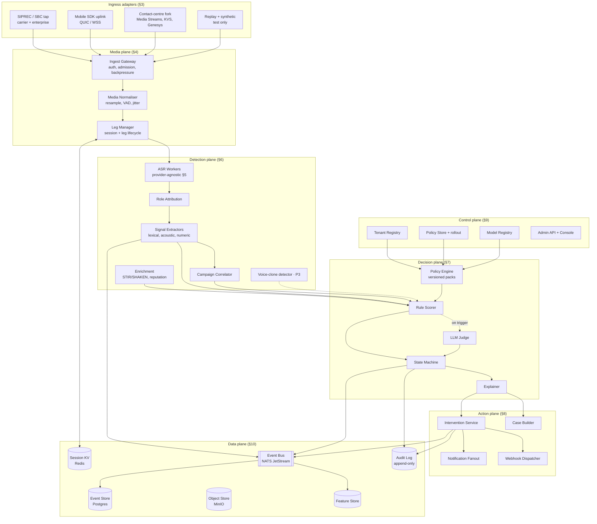
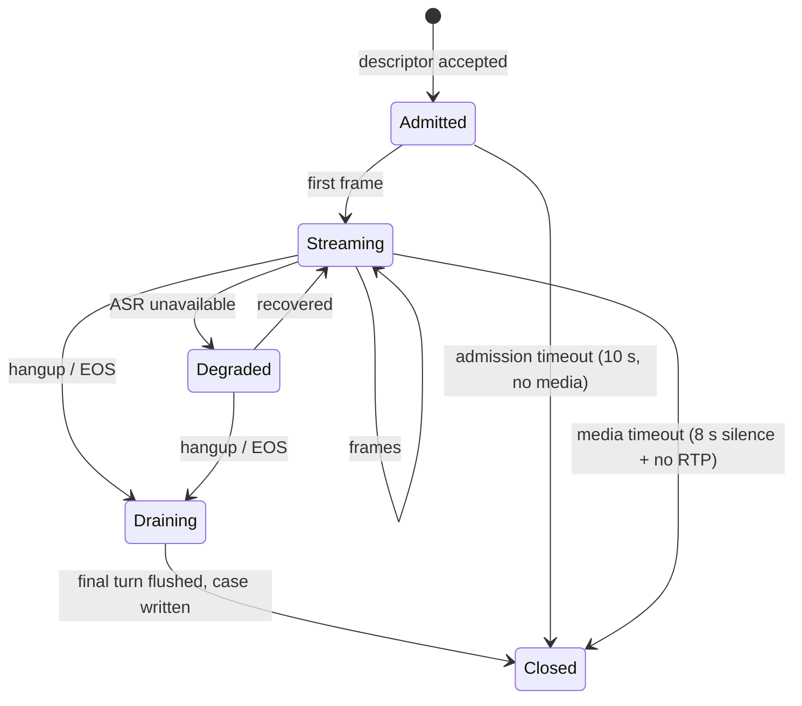
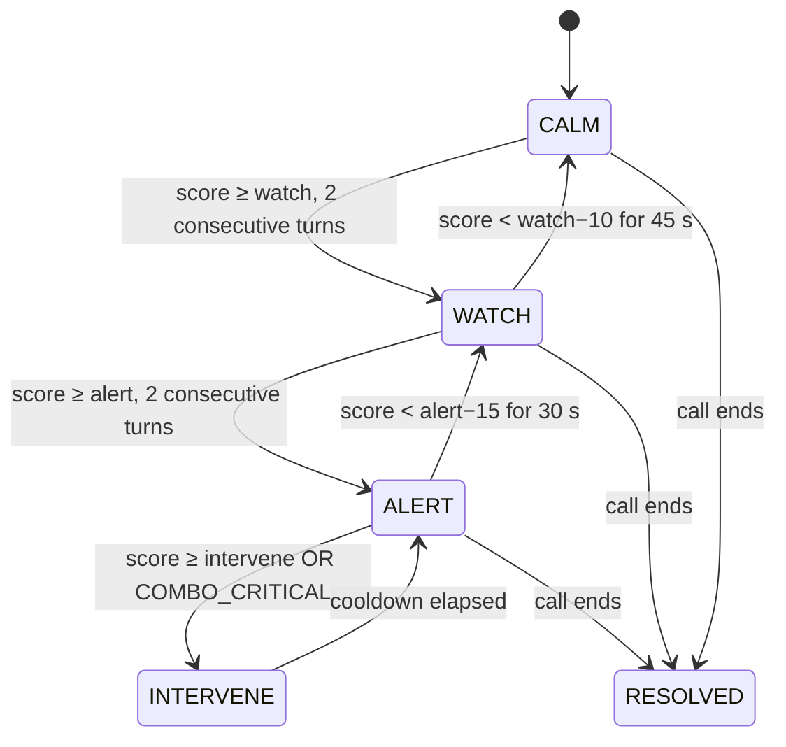
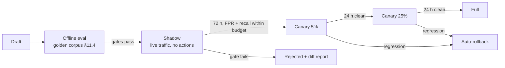
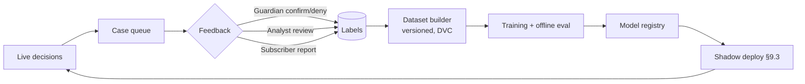

# Ringfence — Production System Design

**Real-time social-engineering defence for live voice calls.**

| | |
|---|---|
| Version | 2.0 — 4 Sept 2026 |
| Supersedes | `RINGFENCE_DESIGN.md` v1.0 (hackathon MVP) |
| Deployment modes | Carrier network · Mobile SDK · Enterprise contact centre — one core, pluggable ingress |
| Sizing baseline | **100 concurrent calls per node**, with documented paths to 10k and 100k |
| Infrastructure posture | **Self-hostable everywhere.** No managed cloud dependency. The same manifests run on a laptop, a single server, and inside an operator's datacentre. |
| Air-gap support | Yes — every external dependency has a self-hosted implementation behind an interface |

---

## Reading guide

This document is written to be built from, in this order:

- **Deciding what to build:** §1, §2, §21
- **Building the core:** §3–§9
- **Operating it:** §12–§15, §18
- **Improving it after launch:** §11
- **Selling it:** §1.2, §12, §13.1, §19

Sections marked **[P1]** are required for first production deployment. **[P2]** is second wave. **[P3]** is on the roadmap and specified only enough to avoid designing them out.

### What changed from v1

The MVP proved one call could be scored. Production changes four things fundamentally:

| Concern | MVP | Production |
|---|---|---|
| Ingress | Browser mic only | Four adapters behind one interface; carrier SIPREC is the primary revenue path |
| ASR | AssemblyAI, hardcoded | Provider interface with AssemblyAI, self-hosted Whisper, and a null provider for tests |
| Detection | One call in isolation | Per-call **plus** cross-call campaign correlation, which is where most of the accuracy gain lives |
| Policy | Constants in Python | Versioned, tenant-scoped policy packs with shadow evaluation and canary rollout |
| Failure | Crash | Degradation ladder — the system always has a defined behaviour with any subset of dependencies down |

---

## 0. Table of contents

1. [Product definition and service levels](#1-product-definition-and-service-levels)
2. [Architecture overview](#2-architecture-overview)
3. [Ingress adapter framework](#3-ingress-adapter-framework)
4. [Media plane](#4-media-plane)
5. [ASR abstraction layer](#5-asr-abstraction-layer)
6. [Detection layer](#6-detection-layer)
7. [Decision plane](#7-decision-plane)
8. [Action plane](#8-action-plane)
9. [Control plane](#9-control-plane)
10. [Data plane](#10-data-plane)
11. [ML platform and continuous improvement](#11-ml-platform-and-continuous-improvement)
12. [Security, privacy and compliance](#12-security-privacy-and-compliance)
13. [Reliability and SRE](#13-reliability-and-sre)
14. [Scaling and capacity model](#14-scaling-and-capacity-model)
15. [Deployment topologies](#15-deployment-topologies)
16. [API surface and SDKs](#16-api-surface-and-sdks)
17. [Testing strategy](#17-testing-strategy)
18. [Runbooks](#18-runbooks)
19. [Cost model and unit economics](#19-cost-model-and-unit-economics)
20. [Roadmap and migration from MVP](#20-roadmap-and-migration-from-mvp)
21. [Architecture decision records](#21-architecture-decision-records)
22. [References](#22-references)

---

## 1. Product definition and service levels

### 1.1 What the system does

Ringfence observes a voice call in real time, attributes speech to the remote and local parties, detects the behavioural moves of social-engineering fraud, and intervenes on the side of the person at risk — before an irreversible transfer of money, credentials, or device control occurs.

It is an **observer**. It never speaks to the adversary, never blocks a call, and never makes an autonomous financial decision.

### 1.2 Deployment modes and who buys them

| Mode | Buyer | Where the code runs | Ingress | Revenue |
|---|---|---|---|---|
| **Carrier** | Mobile / fixed operator fraud team | Operator datacentre or telco cloud | SIPREC tap off the SBC | Per protected line / month |
| **Mobile SDK** | Bank or operator, embedded in their consumer app | End-user handset + cloud | On-device capture | Per active user / month |
| **Enterprise** | Bank, insurer, utility protecting its own lines | Customer VPC or on-prem | SIPREC / contact-centre media fork | Per seat + per audio hour |

The engine is identical across all three. Only the ingress adapter and the intervention channel differ. **This is the central architectural commitment of the document** — everything downstream of §4 is mode-agnostic.

### 1.3 Personas

| Persona | Needs |
|---|---|
| **Protected party** — the person on the call | A warning that is fast, specific, actionable, and almost never wrong |
| **Guardian** — nominated family member | To know something happened, without seeing the call content |
| **Fraud analyst** — operator or bank | Campaign view, case review, policy tuning, evidence for disputes |
| **Tenant admin** | Onboarding, policy configuration, rollout control, usage and billing |
| **SRE** | SLOs, alerts, runbooks, and the ability to shed load without breaking safety |

### 1.4 Service level objectives **[P1]**

SLOs are contractual. Everything in §13 exists to defend these numbers.

| SLO | Target | Measurement window | Error budget |
|---|---|---|---|
| **Warn latency** — trigger utterance to callee-visible warning | p95 ≤ 2.0 s, p99 ≤ 3.5 s | 28 days | 5% of calls may exceed p95 |
| **False positive rate** — protected calls reaching `INTERVENE` that were benign | ≤ 0.5% of intervened calls | 28 days rolling | Hard ceiling; breach halts policy rollout |
| **Detection recall** — confirmed fraud calls warned before the transfer request | ≥ 92% | 28 days | — |
| **Ingest availability** — media accepted and acknowledged | 99.95% | 28 days | 20 min/month |
| **Decision availability** — a decision is produced for an ingested call | 99.9% | 28 days | 43 min/month |
| **Data durability** — audit records | 99.999999999% | annual | — |

**The FPR ceiling outranks every other objective.** A scam shield that cries wolf is uninstalled, and an uninstalled shield has 0% recall. Any change that improves recall while degrading FPR beyond budget is rejected automatically by the release gate in §11.5.

### 1.5 Explicit non-goals

- Not a call blocker or a spam filter. Those are adjacent products with different failure costs.
- Not an authentication system. Ringfence never asserts who the caller *is*, only what they are *doing*.
- Not lawful intercept, and architecturally hostile to being repurposed as such (§12.7).
- Not a general call-recording platform. Retention defaults to nothing.

---

## 2. Architecture overview

### 2.1 Planes

The system separates into five planes with distinct latency, availability and consistency requirements. This is the load-bearing structure of the whole design: **a fault in a slower plane must never stall a faster one.**

| Plane | Latency class | If it fails |
|---|---|---|
| **Media plane** | 20–100 ms, hard real time | Calls unprotected — the only true outage |
| **Detection plane** | 100 ms–1 s, soft real time | Degrade to rules-only, keep protecting |
| **Decision plane** | 100 ms–1 s | Degrade to last-known policy, keep protecting |
| **Action plane** | 1–5 s, best effort | Warnings delayed; log and retry |
| **Control plane** | seconds–minutes, eventually consistent | Config frozen at last-known-good; system keeps running |

### 2.2 Component diagram



### 2.3 Technology choices

Every choice below satisfies one constraint: **it runs on a laptop with `docker compose up` and in a carrier datacentre with the same Helm chart.** No managed-service dependency anywhere.

| Concern | Choice | Why this one |
|---|---|---|
| Event bus | **NATS JetStream** | Single binary locally, clusters in production, gives streams + KV + object store in one dependency. Kafka is the alternative at 100k scale (§14.4) but is heavy to run locally. |
| Hot session state | **Redis / Valkey** | TTL semantics and sub-ms latency for the media plane's per-session state. |
| Event store | **Postgres + TimescaleDB** | Time-series partitioning, and every operator already knows how to run it. |
| Object store | **MinIO** | S3-compatible so cloud deployments swap the endpoint and nothing else. |
| Orchestration | **k3s → Kubernetes** | Same Helm chart from single-node to HA. Docker Compose for laptops. |
| Observability | **OpenTelemetry → Prometheus / Loki / Tempo / Grafana** | Vendor-neutral instrumentation; the backend is swappable per deployment. |
| ASR | **Provider interface** (§5) | AssemblyAI Universal-Streaming primary; self-hosted `faster-whisper` for air-gap. |
| LLM judge | **Provider interface** (§7.4) | AssemblyAI LLM Gateway primary; vLLM-served open model for air-gap. |
| Languages | **Python** (detection, decision) + **Go** (media plane, gateway) | Python for the model-adjacent work, Go where GC pauses and per-connection cost actually matter. |

> **On Python in the media plane.** Do not put Python on the per-frame path. The ingest gateway and normaliser are Go because at 100 concurrent calls that is 2,500 frames/second of small-buffer work, and at 10k it is 250,000/second. Everything downstream operates on turns, not frames, and Python is comfortable there.

---

## 3. Ingress adapter framework

### 3.1 The contract

Every adapter, regardless of transport, produces the same three things. This is the seam that makes one engine serve three markets.

```go
// packages/ingress/contract.go
type Adapter interface {
    // Called once when the adapter accepts a new call.
    OnSessionStart(ctx context.Context, s SessionDescriptor) error
    // Called for every decoded audio frame. MUST NOT block.
    OnFrame(ctx context.Context, f Frame) error
    // Called on hangup, error, or admission rejection.
    OnSessionEnd(ctx context.Context, reason EndReason) error
}

type SessionDescriptor struct {
    TenantID     string
    SessionID    string        // globally unique, adapter-assigned
    Mode         Mode          // Carrier | MobileSDK | Enterprise | Replay
    Legs         []LegSpec     // 1 (mixed) or 2 (separated)
    Signalling   *Signalling   // nil when unavailable (SDK mode)
    ConsentToken string        // §12.3 — no consent, no processing
    StartedAt    time.Time
}

type LegSpec struct {
    LegID    string
    Role     RoleHint   // CallerHint | CalleeHint | Mixed | Unknown
    Codec    Codec
    Rate     int
}

type Frame struct {
    SessionID string
    LegID     string
    PCM       []int16   // normalised downstream; adapters may emit native codec
    Rate      int
    Seq       uint32
    Captured  time.Time // for end-to-end latency attribution
}

type Signalling struct {
    CallerNumber   string   // E.164, may be spoofed — never trusted alone
    CalleeNumber   string
    Attestation    string   // STIR/SHAKEN A | B | C, empty if unavailable
    OriginTrunk    string
    RoamingCountry string
}
```

**Design rule:** an adapter may supply *less* than the full descriptor but never *wrong* information. `Signalling: nil` is always acceptable; a fabricated caller number is not. Detection weights depend on knowing what is genuinely unknown (§6.4).

### 3.2 Adapter A — Carrier SIPREC **[P1, primary revenue path]**

The operator's Session Border Controller forks media to Ringfence using SIPREC (RFC 7866). The SBC is the recording client; Ringfence is the recording server. This is a standard, well-trodden integration that every carrier fraud team already understands, which matters more for sales than any technical property.

```
   Subscriber ──┐
                │        ┌──────────────┐
   PSTN / IMS ──┼────────│     SBC      │──────── normal call path ────▶
                │        │ (recording   │
                │        │   client)    │
                └────────└──────┬───────┘
                                │ SIPREC: SIP INVITE + SDP + rs-metadata
                                │ RTP (2 streams, one per participant)
                                ▼
                   ┌────────────────────────────┐
                   │  Ringfence SIPREC SRS      │
                   │  Kamailio + RTPengine      │
                   │  → decode → Ingest Gateway │
                   └────────────────────────────┘
```

Key properties:

- **Two RTP streams, one per participant.** Role attribution is exact, not inferred. Carrier mode therefore has materially better accuracy than SDK mode, and the difference is measured and reported (§11.6).
- **Metadata gives signalling for free** — calling number, trunk, and STIR/SHAKEN attestation where the operator has it. That feeds enrichment (§6.4).
- **Codec:** typically G.711 (8 kHz) or AMR-WB / EVS (16 kHz). Never assume; read from SDP and resample (§4.2).
- **Passive by construction.** Ringfence receives a fork. It is not in the call path and cannot drop a call even if it crashes. Say this sentence to every carrier: *"if we fail, your calls are unaffected."* It is the single most important architectural property for that sale.
- **Failure mode:** SBC keeps forking into a dead socket. The SRS must respond to SIP OPTIONS keepalives and deregister cleanly on shutdown, or the SBC will accumulate half-open sessions.

Local development substitute: Asterisk or FreeSWITCH configured as a SIPREC client against the same SRS. Identical wire protocol, no carrier needed.

### 3.3 Adapter B — Mobile SDK **[P1]**

Embedded in the bank's or operator's own consumer app. The device captures via speakerphone (the platform reality below), runs a tier-0 edge model, and streams to the cloud when connectivity allows.

**Platform constraints, stated plainly:**

- Android has prohibited using the Accessibility API for call recording since May 2022. No third-party app taps the call stream directly. Speakerphone capture through `AudioSource.MIC` is the supported path.
- iOS does not expose call audio to third-party apps at all. iOS support is therefore **CallKit-adjacent only** — number reputation, post-call review, and guardian features — with no live audio. **Do not promise iOS live protection.** State this in every deck; being caught overpromising it is worse than not having it.
- Battery: continuous capture plus streaming costs roughly 4–7%/hour on a mid-range Android device. Mitigated by tier-0 gating (below).

**Tier-0 edge gating.** The SDK does not stream every call to the cloud. An on-device model — a small keyword-spotting plus embedding classifier, ~3 MB, quantised — watches locally and opens the uplink only when local suspicion crosses a low threshold. Consequences:

- Median call costs zero cloud audio-seconds.
- Privacy story improves dramatically: most calls never leave the device, and that is a sentence a regulator likes.
- Offline degradation is graceful: with no network, tier-0 still warns on the highest-confidence patterns.
- Cost: recall drops for slow-burn scams that never trip tier-0. Measure this explicitly as **gate recall** and treat regressions as release blockers.

Uplink: QUIC where available, WSS fallback. Opus at 16 kHz, 20 ms frames, ~24 kbps. Resumable with a 30 s session token so a network handover does not lose the call.

### 3.4 Adapter C — Enterprise contact centre **[P2]**

Same SIPREC path as carrier where the platform supports it. Where it does not, per-platform shims:

| Platform | Mechanism |
|---|---|
| Genesys / Avaya / Cisco | SIPREC — reuse Adapter A entirely |
| Amazon Connect | Kinesis Video Streams consumer |
| Twilio Flex | Media Streams WebSocket |
| Generic SIP PBX | Asterisk `ChanSpy` / `AudioSocket`, or FreeSWITCH `mod_audio_fork` |

Each shim is ~200 lines and emits the same `Frame` contract. Keep them in `packages/ingress/shims/` and version them separately from the core — vendor APIs change on their own schedule and must never force a core release.

### 3.5 Adapter D — Replay and synthetic **[P1, test only]**

Streams labelled corpus audio at real-time pace through the identical path. This is not a testing nicety; it is the mechanism that makes evaluation (§11), load testing (§17.3) and demos deterministic. It carries a `Mode: Replay` flag that the action plane checks before sending any real notification.

### 3.6 Admission control

Every session passes admission before a single frame is processed:

1. **Tenant authentication** — mTLS for SIPREC and enterprise, signed device token for SDK.
2. **Consent verification** — a valid consent token for the protected party (§12.3). No token, no processing, logged as a rejection.
3. **Quota check** — tenant concurrency limit from the control plane.
4. **Capacity check** — node headroom; if the cluster is above its shed threshold, reject with a specific reason so the SBC does not retry into a brownout.

Rejections are cheap and loud. They are logged, counted per reason, and alerted on. A silent rejection is an unprotected subscriber.

---

## 4. Media plane

### 4.1 Responsibilities

Accept frames, make them uniform, and never block. Everything here is written to fail fast and shed load rather than queue.

### 4.2 Normalisation pipeline

```
frame in (any codec, any rate)
  → decode (G.711 / AMR-WB / EVS / Opus / PCM)
  → resample to 16 kHz mono, int16 LE          [soxr, VHQ]
  → DC removal + level normalisation (preserve relative level — role inference needs it)
  → jitter buffer (adaptive, 40–120 ms)
  → VAD (WebRTC VAD, aggressiveness 2)
  → frame out (16 kHz, 40 ms, tagged voiced/unvoiced)
```

Three rules learned the hard way:

- **Never apply AGC, AEC or noise suppression.** In SDK mode the browser or OS wants to; turn all three off explicitly. Acoustic echo cancellation is designed to remove loudspeaker audio, which in speakerphone capture is the adversary's voice. This single misconfiguration silently deletes half the conversation and is the most common way the whole system appears to work while detecting nothing.
- **Preserve relative level between parties.** Role inference (§6.3) depends on it. Normalise the session, not each leg independently.
- **Trust the wire, not the config.** Read the sample rate from the codec/SDP or the AudioSocket type byte, never from configuration. Deployed telephony stacks routinely deliver 8 kHz while claiming 16.

### 4.3 Session and leg lifecycle



Session state lives in Redis with a TTL of `expected_call_duration + 5 min`, keyed `rf:sess:{tenant}:{session_id}`. It holds only what the media plane needs: leg map, codec state, sequence watermarks, role calibration. **Detection state does not live here** — it lives in the detection worker that owns the session, so that a Redis outage degrades new admissions rather than corrupting in-flight scoring.

### 4.4 Backpressure and load shedding

Bounded queues everywhere, with an explicit shed ladder rather than an unbounded buffer that turns latency into an outage:

| Pressure | Action |
|---|---|
| Queue > 50% | Increase ASR partial interval; stop emitting interim transcripts to the UI |
| Queue > 75% | Suspend tier-2 LLM judging for new sessions; rules-only |
| Queue > 90% | Reject new admissions with `CAPACITY`; protect in-flight calls |
| Queue > 98% | Drop unvoiced frames before the ASR worker |

**Never drop voiced frames from an in-flight protected call.** Reject the next call instead. A partially-analysed call is worse than an unprotected one because it produces a false sense of coverage.

---

## 5. ASR abstraction layer

### 5.1 Why an interface and not a direct dependency

Three unrelated forces demand it: air-gapped carriers who cannot call an external API at all, cost optimisation at 10k+ concurrency, and the plain operational need to survive a provider incident without going dark. The interface is small enough that it costs almost nothing to maintain.

```python
# packages/asr/provider.py
class ASRProvider(Protocol):
    name: str
    capabilities: ASRCapabilities   # languages, diarisation, keyterms, max_concurrency

    async def open(self, spec: StreamSpec) -> ASRStream: ...

class ASRStream(Protocol):
    async def feed(self, pcm: bytes) -> None: ...
    def turns(self) -> AsyncIterator[Turn]: ...
    async def close(self) -> None: ...

@dataclass
class Turn:
    turn_order: int
    text: str
    is_final: bool
    is_formatted: bool
    t_start: float
    t_end: float
    words: list[Word]          # word-level timings, required for §6.3
    confidence: float
    language: str | None
```

### 5.2 Implementations

| Provider | Use | Notes |
|---|---|---|
| `AssemblyAIStreaming` **[P1]** | Default in cloud and hybrid deployments | `wss://streaming.assemblyai.com/v3/ws`, `Authorization: <key>` header with **no `Bearer` prefix**, binary PCM16 frames, `Begin`/`Turn`/`Termination` messages, `{"type":"Terminate"}` to close. Session cap 3 h — re-open at 2h45m and stitch. $0.15/hr on session duration, unlimited concurrent streams. |
| `FasterWhisperLocal` **[P1 for air-gap]** | On-prem, no egress | `faster-whisper` large-v3 on GPU, 2–4 s windows with overlap. Higher latency, no true streaming turn detection — budget §1.4 relaxes to p95 ≤ 4 s in air-gap mode, contractually. |
| `NullASR` | Tests | Replays stored transcripts. Makes the entire detection suite runnable with no network and no cost. |

### 5.3 Routing, failover and cost control

The **ASR Router** sits in front of the providers:

- **Per-tenant policy** picks a provider — a carrier with a no-egress clause never reaches the cloud provider, and this is enforced in code, not documentation.
- **Circuit breaker** per provider: 5 consecutive failures or p99 > 3 s over 30 s opens the breaker. Open breaker → failover provider, or degrade to `NullASR` and rules-on-signalling-only rather than dropping protection entirely.
- **Session stitching** for the 3-hour cap and for reconnects: keep the last 30 s of transcript, re-open, and carry the detection window across. Detection state must survive an ASR reconnect — this is a correctness requirement, not an optimisation.
- **Keyterm priming** where supported: tenant-specific vocabulary (bank names, product names, local place names) materially improves recall of `AUTH_CLAIM` and is configured per tenant in the policy pack.

### 5.4 Language strategy

Detect language in the first 10–15 s, pin it for the session, and record the decision. Do **not** switch sockets mid-call — it loses turn context and the detection window, and the accuracy cost of a wrong pin is smaller than the cost of a reset. For code-switching populations (Derja/French, Spanish/English), prefer a multilingual model over language pinning and measure per-pair accuracy separately; report it, because it is a genuine differentiator and a genuine weakness depending on the pair.

---

## 6. Detection layer

### 6.1 Signal taxonomy **[P1]**

The behavioural core, unchanged in structure from v1 but now versioned and tenant-scoped. Each signal has: `id`, `weight`, `tier`, `languages`, `detector`, `version`.

| ID | Signal | Weight | Tier |
|---|---|---|---|
| `VERIF_INVERT` | Caller asks callee to prove identity — OTP, card number, CVV, national ID | 30 | 1+2 |
| `RAIL_UNUSUAL` | Gift cards, crypto, wire to "safe account", local instant-transfer rails, prepaid top-up | 25 | 1 |
| `REMOTE_ACCESS` | AnyDesk, TeamViewer, "install this app", screen share | 25 | 1 |
| `SECRECY` | "Don't tell anyone", "don't discuss this with staff" | 20 | 1 |
| `CALLBACK_SUPPRESS` | "Stay on the line", "don't call the number on your card" | 18 | 1 |
| `AUTH_CLAIM` | Claims to be bank, police, tax authority, courier, telecom, platform support | 12 | 1 |
| `EMOTION_LEVER` | Family emergency, arrest, deportation, prize | 12 | 2 |
| `URGENCY` | Deadline, account closure, warrant, "right now" | 10 | 1 |
| `ESCALATION` | dPressure/dt above threshold | 10 | derived |
| `SCRIPT_RIGIDITY` | Caller does not adapt to off-script questions | 8 | 2 |

**Protective signals** (negative weight, and the reason FPR stays inside budget):

| ID | Signal | Weight |
|---|---|---|
| `REFUSE_SECRETS` | Caller explicitly declines to take a full card number or OTP | −30 |
| `OFFER_CALLBACK` | Caller invites hanging up and calling the official number | −25 |
| `NO_ACTION_ASKED` | Call closes with no value transfer requested | −20 |
| `BRANCH_REFERRAL` | Caller suggests visiting a branch | −15 |

**Combination rules** — co-occurrence within a window is the actual discriminator:

```
COMBO_CRITICAL  = AUTH_CLAIM ∧ (VERIF_INVERT ∨ RAIL_UNUSUAL ∨ REMOTE_ACCESS)  ≤ 90s   → +35
COMBO_ISOLATION = (SECRECY ∨ CALLBACK_SUPPRESS) ∧ URGENCY                     ≤ 60s   → +20
COMBO_CLASSIC   = AUTH_CLAIM ∧ URGENCY ∧ RAIL_UNUSUAL                         ≤ 120s  → +45
```

> A legitimate bank fraud desk *will* claim authority and *will* create urgency. `AUTH_CLAIM + URGENCY` alone must never reach `ALERT`. This is the tuning constraint that the FPR SLO is built on, and it is asserted as a test (§17.1), not left to judgement.

### 6.2 Extractor architecture

Extractors are independent, versioned, and individually toggleable per tenant. Each returns zero or more `SignalHit` with evidence spans, so every downstream decision can be explained (§7.6).

| Extractor | Method | Latency |
|---|---|---|
| `LexicalExtractor` | Aho–Corasick over per-language lexicons, plus normalised transliteration | < 2 ms |
| `NumericExtractor` | Regex over OTP/PAN/IBAN/amount shapes with Luhn validation | < 1 ms |
| `EntityExtractor` | ASR entity detection: org names, money, dates | provider-side |
| `ProsodyExtractor` **[P2]** | Speaking-rate acceleration, interruption density, pause collapse — stress and pressure correlate with prosody and survive translation | ~10 ms |
| `SemanticExtractor` | Sentence embeddings vs signal prototypes; catches paraphrase that lexicons miss | ~15 ms |
| `DialogueActExtractor` **[P2]** | Classifies turns as request / instruct / reassure / threaten — the *shape* of a scam script | ~20 ms |

`SemanticExtractor` matters more than it looks: lexicons are brittle across dialects and adversaries paraphrase deliberately. Embedding similarity against prototype phrases per signal degrades gracefully where the lexicon has no entry, which is most of the time in low-resource dialects.

### 6.3 Role attribution

Exactness depends on mode, and the system must know which it is working with.

| Mode | Method | Typical accuracy |
|---|---|---|
| Carrier / enterprise, 2 legs | Direct from the RTP stream | ~100% |
| SDK / mixed single stream | Acoustic inference (below) | 85–93% |

Acoustic inference exploits a physical fact: the far-end voice has been through a telephone codec and carries almost no energy above 4 kHz, while the near-end voice was picked up directly in the room and does.

```python
hf_ratio = Σ|X(f)| for f ∈ [4000, 8000) / Σ|X(f)| for f ∈ [300, 3400)
```

Calibrate over the first ~8 s, split into two clusters, classify each turn by median ratio with a confidence from the log-margin. Below 0.4 confidence the turn is `UNKNOWN`: combination rules that require `CALLER` do not fire, tier-1 signals count at half weight. **The system degrades toward silence, never toward false alarms.**

Validation, and it is worth doing properly: run identical calls through both a two-leg and a mixed path, and use the two-leg labels as ground truth to measure the mixed-path classifier. That number is a reported metric (§11.6), tracked per device class, because a phone with aggressive OS-level processing behaves differently from a laptop.

### 6.4 Signalling enrichment **[P1]**

Where the operator provides it, this is the cheapest accuracy available anywhere in the system.

| Signal | Effect |
|---|---|
| STIR/SHAKEN attestation `C` or absent | +8 prior |
| Caller number never seen by this tenant before | +5 |
| Number appears in a live campaign cluster (§6.5) | +25 |
| Number on the tenant's own institutional allowlist | −40 |
| International origin claiming domestic institution | +15 |
| Number reputation feed hit | +10 to +30 by feed confidence |

Two rules: never let signalling alone reach `ALERT` — numbers are spoofed, and a spoofing victim must not be punished. And treat the allowlist as authoritative-negative only; being on it can suppress, never confirm.

### 6.5 Campaign correlation **[P1 — the largest single accuracy gain in this document]**

Individual-call detection has a ceiling. Fraud is industrial: the same script runs against thousands of subscribers within hours. Correlating across calls turns a weak per-call signal into a strong fleet-level one, and it is the capability no on-device competitor can offer.

**Method.** Every completed call emits a privacy-preserving fingerprint — never raw content:

```python
@dataclass
class CallFingerprint:
    tenant_id: str
    t: float
    script_embedding: bytes      # mean sentence embedding of CALLER turns, quantised
    signal_bitmap: int           # which signals fired, as bit flags
    timing_vector: list[float]   # normalised inter-signal intervals — script cadence
    rail_class: str | None       # gift_card | crypto | bank_transfer | remote_access
    caller_prefix: str           # number prefix only, never the full number
    outcome: str | None          # from guardian/analyst feedback, when available
```

Cluster online with a streaming density method (incremental DBSCAN over embedding + timing distance, 6-hour sliding window). A cluster that exceeds a minimum size and cross-subscriber spread becomes a **Campaign**, and every campaign member gets a +25 prior on subsequent calls that match it.

**Why the timing vector matters.** Scam scripts have a cadence — authority claim, then pressure, then rail — with characteristic intervals. Paraphrasing changes the embedding but rarely the cadence. Timing is the more adversarially robust half of the fingerprint.

**Privacy.** Fingerprints carry no transcript, no full numbers, and no subscriber identifiers. Cross-tenant correlation is **off by default** and requires explicit contractual opt-in; when enabled it uses only the embedding and timing vector, never anything tenant-identifying. Design it this way from the start — retrofitting privacy into a correlation system is not realistically possible.

### 6.6 Voice-clone detection **[P3]**

Synthetic-speech detection as an additional signal, not a gate. Specified now only so the interface exists: an extractor returning `synthetic_likelihood ∈ [0,1]` with its own model version, contributing at most +15. Deliberately capped — this field moves fast, false positives on poor-quality codecs are common, and the product must not depend on it.

---

## 7. Decision plane

### 7.1 Policy packs

All tunable behaviour lives in versioned, tenant-scoped, signed policy packs. Nothing that changes a decision is hardcoded, because every such constant becomes an emergency deploy at 02:00 during a false-positive incident.

```yaml
# policy/tn-carrier-a/v14.yaml
apiVersion: ringfence/v1
kind: PolicyPack
metadata:
  tenant: tn-carrier-a
  version: 14
  parent: 13
  author: analyst@carrier.tn
  signed_by: ringfence-policy-signer
spec:
  languages: [ar_tn, fr, en]
  thresholds:
    watch: 30
    alert: 55
    intervene: 75
    sustain_turns: 2
    decay_half_life_s: 90
  signals:
    RAIL_UNUSUAL:
      weight: 28              # raised: local instant-transfer rail abuse
      extra_terms: [d17, flouci, "تحويل فوري"]
    AUTH_CLAIM:
      weight: 12
  combos:
    COMBO_CRITICAL: { bonus: 35, window_s: 90 }
  enrichment:
    shaken_missing_prior: 8
    campaign_prior: 25
    allowlist: [ "+21671xxxxxx" ]
  judge:
    enabled: true
    model: ring-judge-2026-08
    max_adjustment: 30
    trigger_score: 35
    max_calls_per_session: 12
  interventions:
    channels: [in_ear, app_banner, guardian_push]
    cooldown_s: 60
    quiet_hours: null
  slo_overrides: {}
```

Rollout is a control-plane concern (§9.3) and always passes through shadow before it affects a real decision.

### 7.2 Scoring

```
score = clamp(0, 100,
    Σ_signals  weight · age_decay · role_factor
  + Σ_combos   bonus
  + enrichment_prior
  + campaign_prior
  + judge_adjustment
)
```

- `age_decay` — exponential with the pack's half-life, floored at 0.4. Evidence gets old, it does not vanish.
- `role_factor` — `CALLER` 1.0, `UNKNOWN` 0.5, `CALLEE` 0.0. A callee repeating a scammer's words must never incriminate themselves.
- Each signal counts **once per window per role**. Repetition is captured by `ESCALATION`, not by summation, otherwise a stuttering transcript inflates the score.

### 7.3 State machine



Asymmetric hysteresis is deliberate: escalation needs sustained evidence, de-escalation needs a quiet period. Without it, a score oscillating around a threshold produces a stream of warnings and the product is uninstalled within a week.

### 7.4 LLM judge

```python
class Judge(Protocol):
    async def evaluate(self, window: DialogueWindow,
                       pack: PolicyPack) -> Verdict: ...

@dataclass
class Verdict:
    verdict: Literal["benign", "unclear", "suspicious", "fraud"]
    adjustment: int              # bounded by pack.judge.max_adjustment
    signals: list[str]
    protective: list[str]
    rationale: str               # ≤ 25 words, rendered live
    model_version: str
    latency_ms: int
```

Constraints that make an LLM safe in a real-time safety path:

- **It adjusts, it does not decide.** Bounded to ±`max_adjustment`. A hallucinating model perturbs a score; it cannot fire an intervention on its own.
- **Bounded call budget per session.** Trigger on score ≥ 35, on any `RAIL_UNUSUAL`/`REMOTE_ACCESS` hit, or every 20 s in `WATCH`+, capped at `max_calls_per_session`. Cost and latency both stay predictable.
- **Timeout 800 ms, no retry.** A late verdict is worthless. On timeout the rules stand and the miss is counted.
- **`protective` is a required output field.** Models are far better at finding fraud than at noticing its absence unless absence is something you explicitly ask for. This one schema decision moves FPR more than any prompt wording.
- **Temperature 0, structured output enforced**, schema-validated, and a malformed response is treated as a timeout.
- **Prompt and model version are recorded on every verdict.** Without it, post-incident analysis is guesswork.

### 7.5 Degradation ladder

The system must have a defined, tested behaviour for every dependency failure — and it must keep protecting people.

| Failed | Behaviour | Protection retained |
|---|---|---|
| LLM judge | Rules-only scoring | ~85% of recall |
| Semantic extractor | Lexical + numeric only | ~75% |
| ASR primary | Failover provider; if none, signalling + campaign priors only | ~30% |
| Campaign correlator | Per-call scoring only | ~80% |
| Redis | New admissions rejected; in-flight calls unaffected | 100% for in-flight |
| Postgres | Buffer events to local disk queue, replay on recovery | 100% |
| Notification transport | Queue and retry; local warning still delivered | 100% locally |
| **Everything except media + rules** | Tier-1 rules on-device or on-node | ~70% |

Each row is an integration test (§17.2). A degradation path that has never been executed is a hypothesis.

### 7.6 Explainability **[P1]**

Every intervention carries a complete, replayable reason chain. This is not a nicety — it is what a bank needs to defend a decision to a customer, and what an analyst needs to fix a false positive.

```json
{
  "decision_id": "dec_01J...",
  "session_id": "ses_01J...",
  "state": "INTERVENE",
  "score": 82.5,
  "policy_pack": "tn-carrier-a@14",
  "contributions": [
    {"source": "signal", "id": "AUTH_CLAIM", "value": 12.0, "role": "CALLER",
     "t": 14.2, "evidence_span": [14.2, 18.6], "extractor": "lexical@2.3"},
    {"source": "signal", "id": "CALLBACK_SUPPRESS", "value": 18.0, "role": "CALLER",
     "t": 41.0, "evidence_span": [41.0, 44.8], "extractor": "semantic@1.1"},
    {"source": "combo", "id": "COMBO_CRITICAL", "value": 35.0},
    {"source": "enrichment", "id": "shaken_missing", "value": 8.0},
    {"source": "judge", "id": "ring-judge-2026-08", "value": 9.5,
     "rationale": "Caller blocks independent verification and requests transfer code."}
  ],
  "counterfactual": "Without COMBO_CRITICAL the score would be 47.5 (ALERT, not INTERVENE).",
  "replay_token": "rpl_01J..."
}
```

The `counterfactual` field is computed by re-scoring with the single largest contribution removed. It is the field analysts actually read.

---

## 8. Action plane

### 8.1 Intervention channels

| Channel | Mode | Latency | Notes |
|---|---|---|---|
| **In-ear whisper** | SDK | ~300 ms | Audio to the callee's earpiece only. **Never into the call** — the adversary must not learn a shield exists, or the next script routes around it. |
| **App banner** | SDK | ~50 ms | Visual, with the specific action to take |
| **Haptic** | SDK | ~20 ms | Fires first; works when the phone is at the ear |
| **Post-call SMS** | Carrier | seconds | Where live intervention is not permitted or not possible |
| **Agent whisper / screen pop** | Enterprise | ~200 ms | To the human agent, not the customer |
| **Guardian push** | All | 1–5 s | Out of band, verdict only, never content |

### 8.2 Message selection

Warnings are specific and actionable. Generic warnings are ignored, and an ignored warning is a failure.

```yaml
templates:
  RAIL_UNUSUAL:
    en: "Stop. A bank will never ask you to buy gift cards or move money to a safe account."
    fr: "Arrêtez. Une banque ne vous demandera jamais d'acheter des cartes ni de transférer vers un compte sécurisé."
    ar_tn: "أوقف. البنك عمرو ما يطلب منك تشري كارتات ولا تحوّل فلوس."
  VERIF_INVERT:
    en: "Stop. Never read a code or card number to someone who called you."
  REMOTE_ACCESS:
    en: "Stop. Do not install anything or let anyone connect to your phone."
  DEFAULT:
    en: "Hang up and call the number on the back of your card yourself."
```

Selection: highest-weight `CALLER` signal in the last 60 s picks the template; `DEFAULT` otherwise.

### 8.3 Notification fanout

At-least-once with idempotency keys. Guardians receive **verdict only** — timestamp, signals, 25-word rationale, one-tap "call them now". Never transcript, never audio. Rate-limited per guardian per hour so a single bad call cannot become a notification storm.

### 8.4 Case builder

Every `ALERT` or above produces a case for analyst review: decision chain, redacted transcript (if retention is enabled for that tenant), campaign linkage, and a feedback widget whose output is the labelling loop's primary input (§11.2). Cases are the mechanism by which the product gets better; treat the feedback widget as a first-class feature, not an afterthought.

### 8.5 Replay and dry-run safety

The action plane checks `Mode` and `dry_run` before every external effect. A replay session or a shadow policy evaluation can never send a real notification. This check is asserted in a test that runs on every commit — it is the kind of thing that gets broken by an unrelated refactor and discovered by a customer.

---

## 9. Control plane

### 9.1 Tenancy model

```
Organisation
 └── Tenant (isolation boundary: data, policy, keys, quota)
      ├── Deployments  (carrier | sdk | enterprise)
      ├── Policy packs (versioned, signed)
      ├── Allow/deny lists
      ├── Guardians and protected parties
      └── API credentials + webhooks
```

Isolation is enforced at three layers, because one layer is never enough: row-level security in Postgres keyed on `tenant_id`, subject-prefixed NATS streams, and per-tenant encryption keys so that a query bug cannot produce readable cross-tenant data.

### 9.2 Configuration distribution

The control plane is eventually consistent and must never be on the request path. Workers hold a local cache of tenant config and policy packs, refreshed by a watch on the config stream, with a **last-known-good fallback that survives control-plane unavailability indefinitely**. A control-plane outage must not stop protecting a single call.

### 9.3 Policy rollout



**Shadow mode is the most valuable feature in this document.** A candidate policy runs against real live traffic, produces real decisions, and takes no action. Compare against the incumbent, and see exactly which calls would newly fire and which would stop firing — before any subscriber is affected. Nothing else gives you that confidence on a system whose primary risk is false positives.

Auto-rollback triggers on: FPR above budget over a 4-hour window, intervention rate deviating more than 3σ from the incumbent, or p95 warn latency breaching SLO.

### 9.4 Admin console

Tenant onboarding; policy editor with diff and offline-eval preview; shadow and canary dashboards; campaign explorer; case queue; usage and billing; audit log viewer. Read-only by default with explicit elevation for policy changes, and every change is attributed and signed.

---

## 10. Data plane

### 10.1 Stores

| Store | Contents | Retention |
|---|---|---|
| Redis | Hot session state | Session + 5 min |
| NATS JetStream | Event bus, replay buffer | 24 h |
| Postgres/Timescale | Sessions, decisions, cases, campaigns | 90 d default, per-tenant |
| Audit log (append-only) | Every decision, config change, access | 7 y, WORM |
| MinIO | Audio (only if enabled), model artefacts, exports | Per-tenant, default off for audio |
| Feature store | Online features + offline training tables | 180 d |

### 10.2 Core schema

```sql
CREATE TABLE sessions (
  session_id     TEXT PRIMARY KEY,
  tenant_id      TEXT NOT NULL,
  mode           TEXT NOT NULL,
  started_at     TIMESTAMPTZ NOT NULL,
  ended_at       TIMESTAMPTZ,
  language       TEXT,
  leg_count      SMALLINT,
  final_state    TEXT,
  peak_score     REAL,
  policy_pack    TEXT NOT NULL,
  asr_provider   TEXT NOT NULL,
  degraded_modes TEXT[] DEFAULT '{}'      -- what was down during this call
);
SELECT create_hypertable('sessions', 'started_at');
ALTER TABLE sessions ENABLE ROW LEVEL SECURITY;

CREATE TABLE decisions (
  decision_id  TEXT PRIMARY KEY,
  session_id   TEXT NOT NULL REFERENCES sessions,
  tenant_id    TEXT NOT NULL,
  t            TIMESTAMPTZ NOT NULL,
  state        TEXT NOT NULL,
  score        REAL NOT NULL,
  contributions JSONB NOT NULL,           -- the §7.6 reason chain
  judge_version TEXT,
  shadow_of    TEXT                        -- set when produced by a shadow pack
);
SELECT create_hypertable('decisions', 't');

CREATE TABLE campaigns (
  campaign_id   TEXT PRIMARY KEY,
  tenant_id     TEXT NOT NULL,
  first_seen    TIMESTAMPTZ NOT NULL,
  last_seen     TIMESTAMPTZ NOT NULL,
  member_count  INT NOT NULL,
  rail_class    TEXT,
  centroid      BYTEA NOT NULL,
  status        TEXT NOT NULL             -- active | dormant | closed
);

CREATE TABLE feedback (
  feedback_id  TEXT PRIMARY KEY,
  session_id   TEXT NOT NULL REFERENCES sessions,
  source       TEXT NOT NULL,             -- guardian | analyst | subscriber
  label        TEXT NOT NULL,             -- fraud | benign | unclear
  notes        TEXT,
  created_at   TIMESTAMPTZ NOT NULL
);
```

**Transcripts are not in this schema by default.** They live in memory for the duration of the call and are discarded. Tenants who enable retention get a separate, separately-encrypted table with its own retention clock and its own access audit — an opt-in with real friction, deliberately.

### 10.3 Event bus subjects

```
rf.{tenant}.session.started
rf.{tenant}.session.ended
rf.{tenant}.turn                  # ephemeral, 5 min retention
rf.{tenant}.signal
rf.{tenant}.decision
rf.{tenant}.intervention
rf.{tenant}.fingerprint
rf.{tenant}.feedback
rf.control.policy.updated
rf.control.tenant.updated
```

Tenant-prefixed subjects mean isolation is enforced by subscription permissions, not by filtering in application code.

---

## 11. ML platform and continuous improvement

### 11.1 Why this is not optional

Adversaries adapt. A static detector's accuracy decays from the day it ships — measurably, within weeks, as scripts change to avoid whatever fired last month. The system needs a loop that closes faster than the adversary's.

### 11.2 Labelling loop



Sampling strategy matters more than volume:

- **All interventions** get reviewed. Every one.
- **Stratified sample of near-misses** — scores in 40–70, where the decision boundary actually is.
- **Random 0.5% of `CALM` calls** as a bias control. Without this you only ever learn from calls the current model already found, and the model's blind spots become permanent.
- **All disputed cases** at the highest priority.

### 11.3 Feature store

Online features (campaign membership, caller history, tenant priors) served with a p99 budget of 10 ms; offline tables materialised from the same definitions so training and serving cannot drift. One definition, two paths — feature skew is the most common silent cause of "it worked in eval, not in production".

### 11.4 Golden corpus

A frozen, versioned, human-labelled evaluation set. Every model or policy change is measured against it before anything else happens.

| Slice | Minimum | Why |
|---|---|---|
| Confirmed fraud, per family | 200 | Recall |
| **Confirmed benign institutional calls** | **500** | FPR — the binding constraint |
| Benign personal calls | 300 | FPR |
| Per language | 150 each | Fairness |
| Ambiguous / disputed | 100 | Boundary calibration |
| Adversarial / red team | 100 | Robustness |

Grow it continuously; freeze a version per release. Never train on the golden corpus, and enforce that with a hash check in CI rather than a convention.

### 11.5 Release gates

Automated. A change ships only if **all** hold:

```
recall_new        ≥ recall_current − 0.5pp
fpr_new           ≤ min(fpr_current, 0.5%)
p95_latency_new   ≤ p95_current + 100ms
per_language_recall_new ≥ per_language_recall_current − 2pp   # for every language
per_language_fpr_new    ≤ 0.7%                                # for every language
```

The per-language gates prevent the classic failure where aggregate metrics improve because the largest language group improved while a smaller one silently regressed.

### 11.6 Monitored quality metrics

Beyond the SLOs: role attribution accuracy by device class, ASR word error rate on high-signal entities (amounts, institution names, OTP shapes), gate recall for SDK tier-0, campaign precision, judge agreement rate with final labels, and per-signal precision/recall trends. Any signal whose precision falls below 0.6 is automatically demoted to half weight and raised for review — a bad extractor should degrade itself before it degrades the product.

### 11.7 Adversarial hardening

- **Red team on a schedule.** Write new scam scripts specifically to evade the current model each release cycle; those scripts join the golden corpus.
- **Drift detection.** Alert on distribution shift in signal firing rates, script embeddings, and score histograms.
- **Never expose the score.** Not in any API, not in any UI a subscriber sees. A visible score is a gradient for an attacker to optimise against.
- **Randomised thresholds within a narrow band** per tenant, so probing one deployment does not reveal the global boundary.
- **Rate-limit the feedback API.** Otherwise it is a label-poisoning vector.

---

## 12. Security, privacy and compliance

### 12.1 Threat model

| Threat | Vector | Mitigation |
|---|---|---|
| Mass surveillance repurposing | Operator or insider uses Ringfence to monitor calls | No transcript retention by default; audit on every access; content never leaves the decision path; §12.7 |
| Cross-tenant leakage | Query bug, cache bug | RLS + per-tenant keys + subject-prefixed streams |
| Model evasion | Adversary probes the detector | §11.7 |
| Label poisoning | Fake feedback | Authenticated, rate-limited, reputation-weighted feedback |
| Media injection | Forged RTP into the SRS | mTLS, SRTP, source validation against the SBC's addresses |
| Key compromise | Stolen KEK/DEK | Envelope encryption, per-tenant keys, rotation, revocation drill (§18.5) |
| Denial of service | Session flood | Admission control, per-tenant quotas, shed ladder (§4.4) |
| Supply chain | Malicious dependency | SBOM, pinned digests, signed images, `cosign` verification at admission |

### 12.2 Cryptography

- **In transit:** TLS 1.3 everywhere; mTLS between services; SRTP for media where the SBC supports it.
- **At rest:** AES-256-GCM envelope encryption. Per-tenant DEKs wrapped by a KEK in the deployment's KMS — HashiCorp Vault or a cloud KMS behind one interface, so air-gapped installs use Vault and nothing changes.
- **Key rotation:** DEKs every 90 days, KEKs annually, both drilled.
- **BYOK** offered to enterprise tenants: the customer holds the KEK, and revoking it makes their data unreadable including to the operator of the system. That property closes deals.

### 12.3 Consent

No consent token, no processing — enforced at admission (§3.6), not by policy document.

```json
{
  "subject_id": "hashed-subscriber-id",
  "tenant_id": "tn-carrier-a",
  "scope": ["realtime_analysis", "guardian_notify"],
  "granted_at": "2026-08-01T10:00:00Z",
  "expires_at": "2027-08-01T10:00:00Z",
  "revocable": true,
  "jurisdiction": "TN",
  "signature": "..."
}
```

Revocation propagates within 60 seconds and takes effect on the next call. Retention of the consent record itself outlives the data it authorised, because proving you had consent is the point.

**Two-party consent.** Whether the remote party must be informed varies by jurisdiction and is a deployment configuration, not a code assumption. For the SDK, the protected party consents to analysis of their own call on their own device. For carrier deployments the operator's legal basis governs, and the design supports a configurable in-call disclosure tone or announcement where required. Do not ship a single global answer to this question — there isn't one.

### 12.4 Data minimisation

The strongest privacy property in the system is architectural: **the transcript never lands.** It exists in worker memory for the duration of a call and is discarded when the call ends. What persists is the decision chain — signal ids, timestamps, scores — which is sufficient for audit, dispute and improvement, and insufficient for surveillance.

Where a tenant enables retention: PII redaction runs *before* storage, not after. Redacting on read is not redaction.

### 12.5 Regulatory posture

| Regime | Requirement | Approach |
|---|---|---|
| GDPR | Lawful basis, DPIA, subject rights, residency | Legitimate interest (fraud prevention) with a completed DPIA; deploy per region; deletion cascades through all stores including backups within 30 d |
| ePrivacy | Communications confidentiality | Consent-gated; minimisation as the primary argument |
| PCI DSS | If card data is spoken | Card numbers detected and redacted before persistence; Ringfence is never in a cardholder data environment |
| Local telecom law | Who may process call content | Per-deployment legal review; the on-device path avoids the hardest questions entirely |
| AI transparency regimes | Automated decision disclosure | §7.6 explainability; a human-reviewable reason for every intervention |

### 12.6 Audit log

Append-only, hash-chained, WORM-backed. Every decision, config change, data access, key operation and export. Externally anchored daily so tampering is detectable by a third party. Seven-year retention.

### 12.7 The line the system will not cross

Ringfence is designed so that repurposing it for surveillance requires visible, auditable changes rather than a configuration flag:

- Content is never persisted on the default path — there is nothing to hand over.
- No API returns transcript content, at any privilege level.
- Bulk export is limited to decision metadata; there is no bulk content export endpoint to compromise.
- Guardians receive verdicts, never content.
- Every access to any retained content is audited and alertable.

Build it this way from the beginning. Add these properties later and the code that assumed otherwise is already everywhere.

---

## 13. Reliability and SRE

### 13.1 SLO implementation

Each SLO in §1.4 becomes an SLI computed from telemetry, an error budget, and a policy. Budget exhaustion freezes feature deploys and forces reliability work until the budget recovers — that rule is what makes SLOs real rather than decorative.

```
warn_latency_sli   = count(warn_delivered_ms ≤ 2000) / count(interventions)
fpr_sli            = 1 − (confirmed_benign_interventions / total_interventions)
ingest_avail_sli   = 1 − (rejected_capacity + failed_admissions) / offered_sessions
decision_avail_sli = decisions_produced / sessions_ingested
```

### 13.2 Observability

**Traces.** One trace per call, spanning ingest → normalise → ASR → extract → score → judge → intervene, with `Frame.Captured` as the root timestamp so end-to-end latency is measured from the microphone, not from an internal handoff. Sample at 100% for `ALERT`+ sessions and 1% otherwise.

**Key metrics.**

```
rf_sessions_active{tenant,mode}
rf_frames_dropped_total{reason}
rf_asr_latency_seconds{provider,quantile}
rf_asr_breaker_state{provider}
rf_signal_fired_total{signal,language,role}
rf_score_histogram{tenant}
rf_state_transitions_total{from,to}
rf_judge_latency_seconds / rf_judge_timeouts_total
rf_intervention_total{channel,outcome}
rf_warn_latency_seconds          # the SLO metric
rf_degraded_mode_active{component}
rf_policy_pack_version{tenant}
rf_campaign_active{tenant}
```

**Alerts that matter** (everything else is a dashboard):

| Alert | Condition | Severity |
|---|---|---|
| FPR budget burn | Projected breach within 24 h | Page |
| Warn latency SLO | p95 > 2 s for 10 min | Page |
| Intervention rate anomaly | > 3σ from 7-day baseline | Page — usually a bad policy or a real campaign |
| Intervention rate collapse | < 20% of baseline for 30 min | Page — silent failure, the worst kind |
| ASR breaker open | Any provider, > 5 min | Page |
| Admission rejections | > 1% for 10 min | Ticket |
| Signal precision decay | Any signal < 0.6 | Ticket |

> **Intervention rate collapse is the alert people forget to write.** A system that stops detecting looks perfectly healthy on every infrastructure dashboard: CPU normal, no errors, latency excellent. Alert on the absence of work, not only on failures.

### 13.3 Capacity and autoscaling

Scale on **active sessions per worker**, not CPU. CPU is a lagging and misleading indicator when the workload is dominated by waiting on ASR sockets. Target 70% of measured per-pod session capacity, scale up at 80%, down below 50% with a 10-minute stabilisation window to avoid flapping during daily call-volume curves.

### 13.4 Disaster recovery

| Scenario | RTO | RPO | Mechanism |
|---|---|---|---|
| Pod loss | 0 (in-flight calls lost) | n/a | Replicas; SBC re-forks the next call |
| Node loss | < 60 s | 0 | Reschedule; sessions do not migrate — accept the loss, do not build session migration |
| Postgres loss | < 15 min | < 5 min | Streaming replica + PITR |
| Region loss (multi-region only) | < 30 min | < 5 min | Warm standby, DNS/SIP failover |
| Full restore from backup | < 4 h | < 24 h | Quarterly restore drill — a backup that has never been restored is not a backup |

**In-flight calls are not recovered.** Session migration is enormous complexity for a five-minute-maximum loss window; the correct engineering answer is to accept it and make reconnection fast.

---

## 14. Scaling and capacity model

### 14.1 The unit of work

One concurrent call consumes: 1 ASR stream, ~64 kbps ingest, ~2 MB worker memory, roughly 0.8 ms CPU per 40 ms frame for normalisation and acoustic features (≈2% of a core), and 0–12 LLM judge calls over its lifetime.

### 14.2 Baseline — 100 concurrent calls

The first production target, and it fits comfortably on modest hardware.

| Component | Replicas | CPU | RAM |
|---|---|---|---|
| Ingest gateway (Go) | 2 | 2 | 2 GB |
| Media normaliser (Go) | 2 | 4 | 4 GB |
| Detection workers (Python) | 4 | 8 | 8 GB |
| Decision workers | 2 | 2 | 4 GB |
| Campaign correlator | 1 | 2 | 8 GB |
| NATS | 1 | 1 | 2 GB |
| Redis | 1 | 1 | 4 GB |
| Postgres/Timescale | 1 | 4 | 16 GB |
| MinIO | 1 | 1 | 4 GB |
| Observability | 1 | 2 | 8 GB |
| **Total** | | **~27 vCPU** | **~60 GB** |

**Two commodity servers, or one large one.** Fits a single carrier pilot with room to spare.

### 14.3 Scaling to 10k concurrent

Roughly 100× the load; four things change.

1. **Shard detection workers by `session_id`** with consistent hashing, so a session's state stays on one worker and no distributed state is needed on the hot path.
2. **Partition NATS streams**; keep tenant-prefixed subjects so isolation survives partitioning.
3. **Campaign correlator becomes a separate service** with its own store — it is memory-bound on the embedding index, not CPU-bound like everything else.
4. **Postgres gets read replicas** for the console and analytics; writes stay on the primary with Timescale compression on data older than 7 days.

Expect ~250 vCPU and ~600 GB RAM. ASR becomes the dominant cost line (§19), which is when the self-hosted provider starts to pay for itself.

### 14.4 Scaling to 100k concurrent

Now the architecture changes shape rather than just its numbers.

- **Cell-based architecture.** Independent cells of ~10k calls, each a full stack. Blast radius is one cell. Tenants pin to cells. This is the single most important decision at this scale — it converts a global outage into a partial one.
- **Kafka replaces NATS** for the primary event bus; NATS stays for intra-cell control messaging.
- **Multi-region with data residency** — EU traffic never leaves the EU, enforced by cell placement, not by application logic.
- **Self-hosted ASR becomes mandatory economically.** At 100k concurrent, an external per-hour ASR rate dominates every other cost by an order of magnitude.
- **Global campaign correlation across cells** via a dedicated fingerprint aggregation tier — fingerprints are small and privacy-preserving by construction, which is exactly why §6.5 was designed that way.

### 14.5 Cross-cutting scaling rules

- **The media plane is stateless per frame** and the session is sticky. Never make a stateful decision that requires cross-worker coordination on the hot path.
- **Every queue is bounded.** An unbounded queue converts a throughput problem into a latency problem and then into an outage.
- **Degrade before you drop** (§4.4, §7.5) — and validate that degradation preserves the FPR SLO, since a degraded system with a higher false-positive rate is worse than no system.

---

## 15. Deployment topologies

### 15.1 Local — laptop, full system

The same images and the same configuration surface as production. Nothing about the local topology is a special case, which is what keeps it honest.

```yaml
# infra/compose/docker-compose.yml  (abridged)
services:
  nats:      { image: nats:2-alpine, command: ["-js"], ports: ["4222:4222"] }
  redis:     { image: valkey/valkey:8-alpine }
  postgres:  { image: timescale/timescaledb:latest-pg16,
               environment: { POSTGRES_PASSWORD: dev } }
  minio:     { image: minio/minio, command: server /data --console-address ":9001" }

  gateway:
    build: ./apps/gateway
    environment:
      RF_MODE: local
      RF_NATS: nats://nats:4222
      RF_REDIS: redis://redis:6379
      RF_ASR_PROVIDER: assemblyai      # or faster_whisper, or null
      ASSEMBLYAI_API_KEY: ${ASSEMBLYAI_API_KEY}
    ports: ["8000:8000"]

  detector:  { build: ./apps/detector,  deploy: { replicas: 2 } }
  decider:   { build: ./apps/decider }
  actioner:  { build: ./apps/actioner,  environment: { RF_DRY_RUN: "true" } }
  console:   { build: ./apps/console,   ports: ["3000:3000"] }

  # Optional: local SIPREC source, so the carrier path is developed locally too
  asterisk:  { image: andrius/asterisk:20-current, network_mode: host,
               volumes: ["./asterisk:/etc/asterisk:ro"] }
```

```bash
make dev-up            # everything
make replay FILE=corpus/audio/scam_bank_fr_01.wav
make eval              # full golden-corpus run, offline, no cost
```

Note `RF_DRY_RUN: "true"` on the actioner in local compose. Local development must never be able to send a real notification.

### 15.2 Single-node production — 100 concurrent

k3s on one server, the same Helm chart as HA with `replicas: 1` and the co-located datastores. Suitable for a design-partner pilot or an on-prem enterprise deployment. Backups to a second box or an S3-compatible target.

### 15.3 HA cluster — 1k–10k concurrent

Kubernetes, 3+ nodes, anti-affinity across zones, Postgres with a synchronous replica, NATS clustered with 3 replicas, HPA on active sessions. Same chart, different values file — and that property is worth protecting, because the moment production and local diverge, local stops catching bugs.

### 15.4 Air-gapped carrier deployment

For operators who will not permit egress. Everything self-hosted: `faster-whisper` on GPU nodes for ASR, a local model served by vLLM for the judge, Vault for KMS, a private registry mirror, and offline policy-pack delivery by signed bundle. Documented SLO relaxation for latency (§5.2) because local ASR is slower, agreed contractually rather than discovered by the customer.

### 15.5 Helm values sketch

```yaml
ringfence:
  mode: carrier                 # carrier | sdk | enterprise | hybrid
  scale:
    targetConcurrentCalls: 100
  asr:
    provider: assemblyai
    fallback: faster_whisper
    egressAllowed: true         # false forces local-only, enforced in code
  judge:
    provider: llm_gateway
    enabled: true
  privacy:
    retainTranscripts: false
    retainAudio: false
    redactBeforeStore: true
  campaign:
    enabled: true
    crossTenant: false          # contractual opt-in only
  kms:
    provider: vault
  observability:
    otlpEndpoint: http://otel-collector:4317
```

---

## 16. API surface and SDKs

### 16.1 Public REST — control and query only

Never on the media path.

```
POST   /v1/sessions/{id}/feedback        submit a label
GET    /v1/sessions/{id}                 session summary (no content)
GET    /v1/sessions/{id}/decisions       decision chain
GET    /v1/campaigns                     active campaigns
GET    /v1/campaigns/{id}/members        member sessions (metadata only)
POST   /v1/policy-packs                  create draft
POST   /v1/policy-packs/{v}/evaluate     offline eval against golden corpus
POST   /v1/policy-packs/{v}/shadow       start shadow
POST   /v1/policy-packs/{v}/promote      canary → full
GET    /v1/consent/{subject}             consent status
DELETE /v1/consent/{subject}             revoke (≤ 60 s propagation)
GET    /v1/usage                         metered usage for billing
```

**There is deliberately no endpoint that returns transcript content** (§12.7).

### 16.2 Webhooks

```json
{
  "event": "intervention.fired",
  "tenant_id": "tn-carrier-a",
  "session_id": "ses_01J...",
  "occurred_at": "2026-09-04T14:22:31.442Z",
  "state": "INTERVENE",
  "score": 82.5,
  "signals": ["AUTH_CLAIM", "CALLBACK_SUPPRESS", "VERIF_INVERT"],
  "campaign_id": "cmp_01J...",
  "rationale": "Caller blocks independent verification and requests transfer code.",
  "decision_url": "https://console.../decisions/dec_01J..."
}
```

Signed with HMAC-SHA256 over the raw body, `t=` timestamp in the signature header, at-least-once with idempotency keys and exponential backoff to 24 h.

### 16.3 Mobile SDK

```kotlin
val ringfence = Ringfence.initialize(
    context, apiKey = BuildConfig.RF_KEY,
    config = RingfenceConfig(
        edgeGating = true,          // tier-0 on-device, uplink only on suspicion
        uplink = Uplink.QUIC,
        interventions = setOf(InEar, Banner, Haptic),
        guardian = GuardianConfig(enabled = true),
    ),
)

ringfence.onIntervention { i ->
    // i.signals, i.rationale, i.suggestedAction — never transcript
}
ringfence.protect(callId)   // requires consent token; throws without one
```

The SDK exposes signals and rationale, never transcript. Same principle as the API, enforced by the type system rather than by review.

### 16.4 Internal gRPC

Media plane → detection → decision over gRPC with protobuf, mTLS, deadlines on every call, and no retries on the hot path — a retried frame is a late frame, and a late frame is worthless.

---

## 17. Testing strategy

### 17.1 Invariants asserted as tests

These are the properties that must never regress, encoded rather than remembered:

```python
def test_authority_plus_urgency_alone_never_alerts():
    """The FPR SLO depends on this. A real bank does both."""
    s = run_replay("golden/benign/bank_fraud_desk_fr_003.wav")
    assert s.peak_state in {"CALM", "WATCH"}
    assert s.peak_score < pack.thresholds.alert

def test_callee_speech_never_incriminates():
    """A victim repeating the scammer's words must not raise the score."""
    s = run_replay("golden/synthetic/callee_repeats_scam_terms.wav")
    assert s.peak_score < 20

def test_judge_cannot_fire_intervention_alone():
    with judge_forced("fraud", adjustment=999):
        s = run_replay("golden/benign/delivery_call_en_012.wav")
        assert s.final_state != "INTERVENE"

def test_dry_run_sends_nothing():
    with capture_egress() as egress:
        run_replay("golden/fraud/bank_impersonation_ar_001.wav", dry_run=True)
        assert egress.calls == []

def test_transcript_never_persisted_by_default():
    run_replay("golden/fraud/bank_impersonation_ar_001.wav")
    assert db.query("SELECT count(*) FROM transcripts") == 0
```

### 17.2 Degradation tests

Every row of §7.5 is a test that kills the dependency and asserts both the retained protection level and that FPR does not rise. Run in CI against the compose stack.

### 17.3 Load and soak

A synthetic call generator replays corpus audio through the real ingress at target concurrency. Load test at 1.5× target; soak for 72 h at 1× watching for memory growth, socket leaks, and — the one that always appears — unbounded growth in the campaign correlator's embedding index.

### 17.4 Chaos

Scheduled fault injection in staging: kill workers mid-call, partition NATS, add 500 ms of ASR latency, expire a policy signature, revoke a consent token mid-call. Each has an expected behaviour documented in §18.

### 17.5 Fairness testing

Per-language and per-accent FPR and recall, tested on every release. A shield that works well in French and poorly in Derja is not a product for Tunisia — and aggregate metrics will hide exactly that. This is why the per-language release gates in §11.5 exist.

---

## 18. Runbooks

### 18.1 False-positive storm

**Symptom:** intervention rate > 3σ above baseline.
1. Check `rf_policy_pack_version` — did a pack just roll out? If canary, auto-rollback should have fired; if not, roll back manually and file a bug against the automation.
2. Check `rf_campaign_active` — a genuine campaign also produces a spike. Sample 10 cases before assuming a bug.
3. If a policy issue: promote the previous pack (single API call, no deploy).
4. If an extractor issue: disable that extractor for the tenant via config; it takes effect within 60 s.
5. Write the offending calls into the golden corpus before closing the incident. An incident that does not become a test will recur.

### 18.2 ASR provider outage

**Symptom:** `rf_asr_breaker_state{provider} = open`.
1. Confirm failover engaged; check `rf_degraded_mode_active`.
2. If no fallback is configured for that tenant, the system is on signalling + campaign priors only — protection is ~30%. Notify the tenant; this is contractually a degradation, not an outage.
3. Do not manually close the breaker. It closes on sustained health.
4. If the outage exceeds 30 minutes, consider temporarily enabling the local provider even at higher latency.

### 18.3 Intervention rate collapse

**Symptom:** rate < 20% of baseline. **This is the most dangerous alert in the system** — everything looks healthy.
1. Verify traffic is actually arriving: `rf_sessions_active`.
2. Verify turns are being produced: `rf_signal_fired_total` by language. A collapse in one language points at ASR language detection, not at the detector.
3. Check for a silently-failing extractor — a bad lexicon deploy is the usual cause.
4. Replay three golden fraud calls through production. If they do not fire, it is the pipeline, not the traffic.

### 18.4 Backpressure / capacity

1. Check the shed ladder stage in `rf_frames_dropped_total{reason}`.
2. Scale detection workers — they are almost always the constraint.
3. If scaling is not possible, reduce tenant quotas rather than letting all calls degrade. Partial full protection beats universal partial protection.

### 18.5 Key compromise

1. Revoke the affected KEK in Vault immediately.
2. Re-wrap affected tenant DEKs with a new KEK.
3. Audit every access to the affected tenant's data over the exposure window from the audit log.
4. Notify per contractual and regulatory timelines — GDPR is 72 hours.
5. Run the rotation drill afterwards and record the elapsed time; that number is the real RTO.

### 18.6 Consent revocation

Propagates within 60 s. Verify the subject is rejected at admission on the next call, verify retained data is purged within the tenant's window, and record the completion in the audit log. A revocation that is not evidenced did not happen.

---

## 19. Cost model and unit economics

### 19.1 Per-call cost, 5-minute call

| Component | Cloud ASR | Self-hosted ASR |
|---|---|---|
| ASR (1 leg, $0.15/hr) | $0.0125 | ~$0.004 amortised GPU |
| ASR (2nd leg, carrier mode) | $0.0125 | ~$0.004 |
| LLM judge (≤12 calls, triggered only) | ~$0.010 | ~$0.002 |
| Compute, storage, bandwidth | ~$0.002 | ~$0.002 |
| **Total** | **~$0.037** | **~$0.012** |

### 19.2 Per-subscriber monthly

Assuming 4 calls/day, 150 calls/month, and SDK tier-0 gating opening the uplink on ~12%:

| Mode | Analysed calls/month | Cost |
|---|---|---|
| SDK with edge gating | ~18 | **~$0.45** |
| Carrier, all calls, cloud ASR | 150 | **~$5.55** |
| Carrier, all calls, self-hosted | 150 | **~$1.80** |

### 19.3 The economics conclusion

At carrier scale with full-traffic analysis, **ASR is 70–80% of cost of goods**, and self-hosting cuts unit cost by roughly two thirds. That is the number that determines gross margin, and it is the reason §5's provider interface exists from day one rather than as a later refactor.

Two consequences worth building around: pre-filtering (skip analysis on established contacts and short calls) is the highest-leverage cost optimisation available and typically removes 40–60% of analysed minutes; and against a fraud loss of hundreds to thousands per incident, even the uneconomical configuration clears its ROI bar comfortably — the pricing conversation is about value, not cost.

---

## 20. Roadmap and migration from MVP

### 20.1 From v1 to production

| MVP component | Fate |
|---|---|
| Browser capture | Becomes the SDK adapter and the replay path |
| AssemblyAI client | Wrapped in the provider interface (§5) |
| Role classifier | Kept as-is; now measured per device class |
| Tier-1 features | Kept; weights externalised into policy packs |
| LLM judge | Kept; bounded, versioned, budgeted |
| State machine | Kept; thresholds move into policy packs |
| Dashboard | Becomes the analyst console |
| Evaluation harness | **Becomes the release gate** — the highest-leverage MVP artefact |

Nothing is thrown away, and that is not an accident: the MVP was designed against these interfaces.

### 20.2 Phases

| Phase | Duration | Delivers |
|---|---|---|
| **P0 — Hardening** | 6 weeks | Provider interfaces, policy packs, tenancy, audit log, observability, compose + Helm parity |
| **P1 — First deployment** | 8 weeks | SIPREC adapter, campaign correlation, shadow mode, console, consent, SLO instrumentation. **Design-partner pilot at 100 concurrent.** |
| **P2 — Scale and SDK** | 12 weeks | Android SDK with edge gating, enterprise shims, 10k capacity, ML platform and labelling loop, prosody and dialogue-act extractors |
| **P3 — Depth** | ongoing | Voice-clone detection, cross-tenant campaigns, multi-region, cell architecture, air-gapped GA |

### 20.3 What to build first, and why

Sequence by risk retired per week, not by feature appeal:

1. **The golden corpus and the evaluation harness.** Everything else is unmeasurable without them, and every later decision depends on being able to tell whether a change helped.
2. **Policy packs and shadow mode.** Without shadow, every tuning change is a gamble on live subscribers — and FPR is the SLO that decides whether the product survives.
3. **The SIPREC adapter.** It is the revenue path and the source of two-leg ground truth for everything else.
4. **Campaign correlation.** The largest accuracy gain available, and the moat no on-device competitor can copy.
5. **The SDK.** Largest market, hardest platform constraints — and by this point the core is proven, so the SDK is an adapter rather than a rewrite.

---

## 21. Architecture decision records

**ADR-001 — Observer, never in the call path.**
*Decision:* Ringfence receives a media fork and never terminates, bridges or blocks a call.
*Why:* A carrier will not deploy anything that can drop calls. Being passive turns the availability conversation from "prove five nines" into "if we fail, your calls are unaffected." It also removes an entire class of catastrophic failure.
*Cost:* Cannot block a fraudulent call, only warn.

**ADR-002 — Pluggable ingress, single core.**
*Decision:* All deployment modes converge on one `Frame` contract at the media plane boundary.
*Why:* Three markets, one detection engine, one evaluation corpus, one set of release gates. Splitting the core per mode would triple the work that actually matters and fragment the metrics.
*Cost:* The contract must accommodate the weakest adapter, so mode-specific advantages (exact roles in carrier mode) are handled as capability flags rather than assumed.

**ADR-003 — Rules decide, models adjust.**
*Decision:* The LLM judge is bounded to ±30 and can never fire an intervention alone.
*Why:* FPR is the binding SLO and the product's survival condition. A bounded model perturbs a decision; an unbounded one can invent an incident. Also makes every decision explainable, which regulated buyers require.
*Cost:* Some recall left on the table where the model is right and the rules are wrong.

**ADR-004 — No transcript retention by default.**
*Decision:* Transcripts exist in worker memory only, discarded at call end.
*Why:* It is the strongest privacy property available and it is architectural rather than procedural. It also makes the regulatory conversation dramatically shorter, and it removes the most attractive target in the system.
*Cost:* Debugging production false positives is harder — mitigated by the decision chain (§7.6) and by opt-in retention for design partners.

**ADR-005 — Self-hostable everything.**
*Decision:* No managed-service dependency; every external service sits behind an interface with a self-hosted implementation.
*Why:* Carriers and banks frequently refuse public cloud, and air-gapped deployments are a real segment. It also keeps local development identical to production, which is what keeps local development useful.
*Cost:* More operational surface than a cloud-native build, and the team owns Postgres, NATS and Redis rather than renting them.

**ADR-006 — Campaign correlation from day one, privacy-preserving by construction.**
*Decision:* Fingerprints carry embeddings and timing only — never content, never full numbers, never subscriber identifiers.
*Why:* Cross-call correlation is the largest accuracy gain and the clearest moat, but a correlation system built on content cannot be retrofitted into a private one. Designing the fingerprint first makes cross-tenant correlation contractually possible later.
*Cost:* Some signal lost versus correlating on raw content.

**ADR-007 — Accept in-flight call loss on node failure.**
*Decision:* No session migration.
*Why:* Sessions are ≤ a few minutes. Migration means replicating media-plane state continuously for a small, bounded loss — enormous complexity against a tiny benefit.
*Cost:* A node failure loses protection for calls in progress on that node.

---

## 22. References

- [AssemblyAI — Universal-Streaming documentation](https://www.assemblyai.com/docs/speech-to-text/universal-streaming) — endpoint, authentication, message shapes, PCM requirements, session limits
- [AssemblyAI — Voice Agent API](https://www.assemblyai.com/products/voice-agent-api) — turn detection, tool calling, latency characteristics
- [AssemblyAI — pricing](https://www.assemblyai.com/pricing) — streaming, redaction and understanding rates used in §19
- [AssemblyAI — building without an orchestration framework](https://www.assemblyai.com/blog/build-voice-agent-without-pipecat-livekit) — the transport is a plain WebSocket; telephony only terminates the PSTN leg
- [RFC 7866 — Session Recording Protocol (SIPREC)](https://datatracker.ietf.org/doc/html/rfc7866) — the carrier ingress standard
- [RFC 8224 — Authenticated Identity Management in SIP (STIR)](https://datatracker.ietf.org/doc/html/rfc8224) — attestation used in §6.4
- [Asterisk — AudioSocket](https://docs.asterisk.org/Configuration/Channel-Drivers/AudioSocket/) — 3-byte header, type codes, sample-rate variants
- [asterisk/asterisk-external-media](https://github.com/asterisk/asterisk-external-media) — ARI ExternalMedia reference implementation
- [Google Play policy, May 2022](https://www.phonearena.com/news/google-will-put-an-end-to-third-party-call-recording-apps-soon_id139778) — Accessibility API may not be used for call recording
- [DeepStrike — vishing statistics](https://deepstrike.io/blog/vishing-statistics-2025) — attack growth rates and per-incident loss figures
- [NATS JetStream](https://docs.nats.io/nats-concepts/jetstream) · [TimescaleDB](https://docs.timescale.com/) · [OpenTelemetry](https://opentelemetry.io/docs/)

---

*Ringfence production design v2.0. Every section is meant to be argued with — if the constraint it assumes is not your constraint, change the section and note why in an ADR.*
